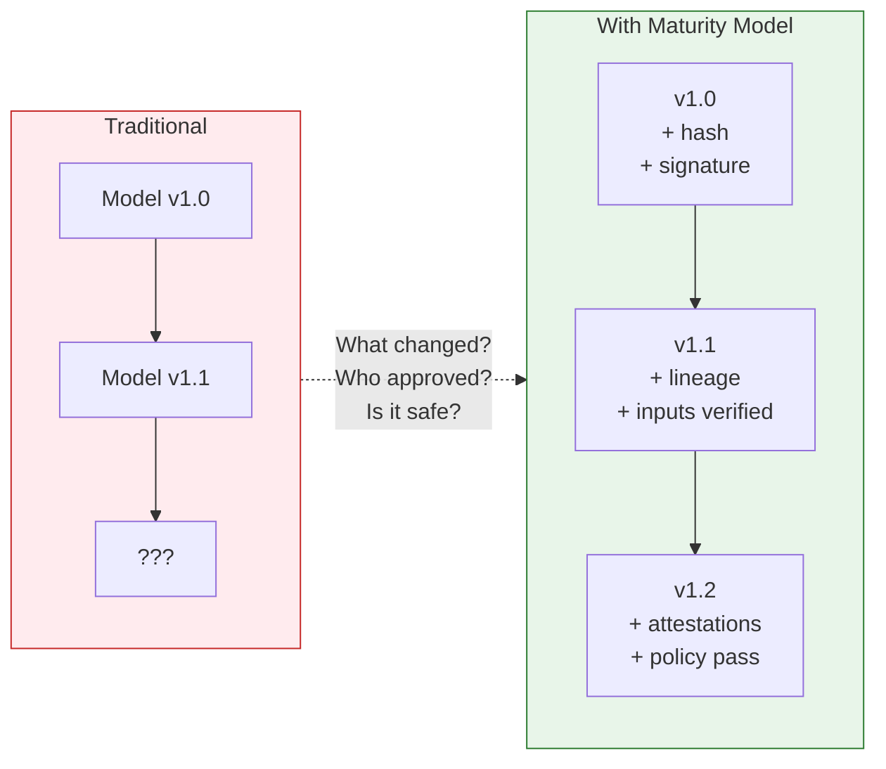
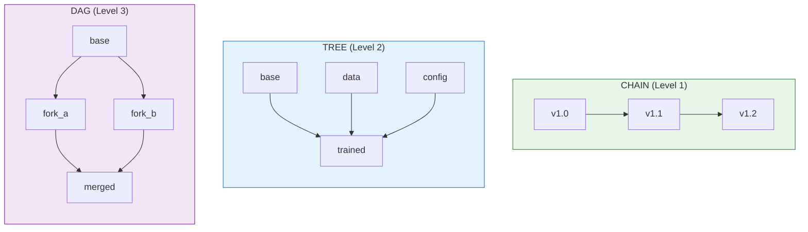
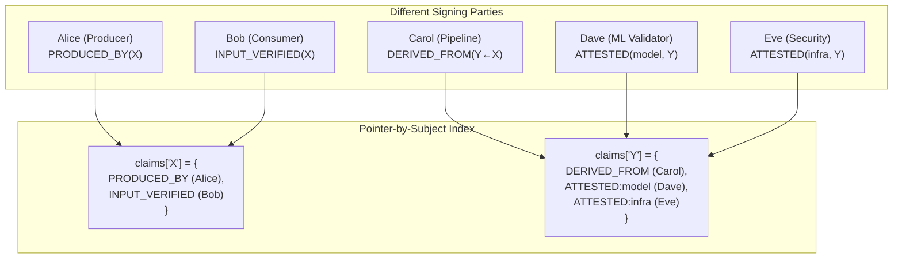

# Artifact Integrity Maturity Model
## Progressive Security for AI Artifact Provenance

**Version:** 1.0.0  
**Status:** Draft  
**Framework Alignment:** CoSAI-RM, MITRE ATLAS, OWASP LLM Top 10, SLSA, in-toto

---

## Abstract

AI artifacts (models, training data, configurations) require cryptographic proof of integrity, lineage, and policy compliance. This standard defines a **progressive maturity model** enabling organizations to start with basic integrity and advance to full attestation-based provenance as operational requirements grow.

The model addresses three orthogonal concerns: **claims** (what can be proven), **topology** (how artifacts relate), and **verification** (how proofs are validated).

---

## The Fundamental Problem



**The vulnerability:** Artifacts flow through ML pipelines without cryptographic proof of what they are, where they came from, or whether they're safe to deploy.

**The solution:** Progressive claims that prove integrity (L1), lineage (L2), and policy compliance (L3).

---

## Maturity Levels

| Level | Name | Proves | Topology |
|-------|------|--------|----------|
| **1** | Basic Integrity | "This artifact exists, was created by X, and hasn't changed" | Chain |
| **2** | Chaining & Lineage | "This artifact was derived from verified inputs through a documented process" | Chain, Tree |
| **3** | Attestations & Policy | "This artifact meets policy requirements and is approved for deployment" | Chain, Tree, DAG |

---

## Invariants by Level

### Level 1: Basic Integrity

| ID | Invariant | Assertion | Required |
|----|-----------|-----------|----------|
| INV-L1-01 | **Measured** | `H(artifact_content) == integrity.digest` | ✓ |
| INV-L1-02 | **Produced By** | `signature.signer == claimed_producer` | ✓ |
| INV-L1-03 | **Signer Verified** | `signer.subject ∈ trust_store` | ✓ |
| INV-L1-04 | **Timestamped** | `\|now() - signed_at\| < tolerance` | ○ |

**Formal Claims:**
```
MEASURED <TARGET X> as (hash) SIGNED BY A
<TARGET X> was PRODUCED BY A
SIGNER A verified against trust_store
```

### Level 2: Chaining and Lineage

| ID | Invariant | Assertion | Required |
|----|-----------|-----------|----------|
| INV-L2-01 | **Derived From** | `lineage.inputs[].artifact_id EXISTS` | ✓ |
| INV-L2-02 | **Input Verified** | `∀ input: H(input) == original_digest` | ✓ |
| INV-L2-03 | **Evidence Backed** | `derivation_claim.evidence EXISTS` | ○ |
| INV-L2-04 | **Chain Linked** | `H(prev.sig) == chain_signature.prev_hash` | ✓ |
| INV-L2-05 | **Timestamped (Strict)** | `\|now() - signed_at\| < 60s` | ✓ |

**Formal Claims:**
```
<TARGET Y> was DERIVED FROM <TARGET X> SIGNED BY A
INPUT <TARGET X> was VERIFIED as Hash
INPUT <X.1> was DERIVED FROM <X> BY <PROCESS> SIGNED BY A
```

### Level 3: Attestations and Policy

| ID | Invariant | Assertion | Required |
|----|-----------|-----------|----------|
| INV-L3-01 | **Attested (Process)** | `attestations.process EXISTS + signed` | ✓ |
| INV-L3-02 | **Attested (Model)** | `IF type=model: attestations.model EXISTS` | Conditional |
| INV-L3-03 | **Attested (Data)** | `IF uses_training_data: attestations.data EXISTS` | Conditional |
| INV-L3-04 | **Attested (Infra)** | `attestations.infrastructure EXISTS` | ○ |
| INV-L3-05 | **Policy Evaluated** | `policy.evaluations[].result ∈ {PASS, WARN}` | ✓ |
| INV-L3-06 | **Admission Gated** | `IF deploying: admission_status.admitted` | Conditional |

**Formal Claims:**
```
ATTESTED(process) by attester SIGNED
ATTESTED(model) with metrics SIGNED
POLICY_EVALUATED with result
ADMISSION_GATED for target environment
```

---

## Topology Selection

Organizations select lineage topology based on operational requirements:



| Topology | Max Inputs | Branching | Merging | Verification | Use Case |
|----------|------------|-----------|---------|--------------|----------|
| **Chain** | 1 | ✗ | ✗ | O(n) | Version history |
| **Tree** | ∞ | ✓ | ✗ | O(n) DFS | Training pipelines |
| **DAG** | ∞ | ✓ | ✓ | O(V+E) | Model merging, ensembles |

---

## Sensible Defaults

### Level 1 Defaults

```yaml
integrity:
  algorithm: SHA256
  alternatives: [SHA384, SHA512, SHA3-256]

signature:
  algorithm: RS256
  alternatives: [ES256, ES384, EdDSA]
  key_rotation_days: 90
  min_key_size_rsa: 2048
  min_key_size_ec: 256

timestamp:
  required: false
  tolerance_seconds: 300
  source: local

trust_store:
  type: static
  refresh_hours: 24
```

### Level 2 Defaults (Overrides)

```yaml
timestamp:
  required: true           # Now mandatory
  tolerance_seconds: 60    # Stricter
  source: tsa              # Time Stamping Authority

lineage:
  max_chain_depth: 100
  input_verification: required
  process_parameters_hash: required
  log_retention_days: 365
```

### Level 3 Defaults (Overrides)

```yaml
signature:
  algorithm: ES384         # Stronger curve

attestations:
  required_categories: [process]
  recommended_categories: [model, data, process, infrastructure]
  predicate_types:
    default: "https://in-toto.io/attestation/v1"
    provenance: "https://slsa.dev/provenance/v1"
  attester_trust_level_for_production: high

policy:
  engine: opa
  format: rego
  minimum_rules:
    - artifact_integrity
    - lineage_verified
    - attestations_present
  admission_controller: gatekeeper

compliance:
  evidence_retention_days: 2555  # 7 years
  check_frequency: daily
```

---

## Risks & Controls

### Risk: Artifact Tampering (ATLAS: AML.T0048)
**Threat:** Artifact content modified after signing.  
**Control:** INV-L1-01 — Hash verification detects any modification.

### Risk: Lineage Manipulation
**Threat:** False derivation claims or input substitution.  
**Control:** INV-L2-02 — All input hashes verified before derivation.

### Risk: Diamond Inconsistency (DAG only)
**Threat:** Same artifact has different hashes via different paths.  
**Control:** Diamond consistency check during DAG verification.

### Risk: Attestation Forgery (ATLAS: AML.T0043)
**Threat:** False attestations about model performance or data provenance.  
**Control:** INV-L3-01/02/03 — Attestation signatures verified against trusted attesters.

### Risk: Policy Bypass
**Threat:** Deployment without required policy evaluation.  
**Control:** INV-L3-05/06 — Policy evaluation and admission gate required.

---

## Validation Sequence

### Level 1

```
1. VERIFY signature.algorithm ∈ allowed_algorithms
2. VERIFY signature over canonical manifest              [INV-L1-02]
3. VERIFY signer.subject ∈ trust_store                   [INV-L1-03]
4. VERIFY H(artifact_content) == integrity.digest        [INV-L1-01] ← critical
5. IF timestamp: VERIFY |now() - signed_at| < tolerance  [INV-L1-04]
6. RETURN {measured: ✓, produced_by: ✓, signer_verified: ✓}
```

### Level 2 (extends Level 1)

```
7.  VERIFY chain_position > 0 OR chain_integrity == "GENESIS"
8.  FOR EACH input: VERIFY H(input) == original_digest   [INV-L2-02] ← critical
9.  IF previous: VERIFY H(prev.sig) == prev_sig_hash     [INV-L2-04]
10. IF topology == TREE: VERIFY no_diamonds(graph)
11. IF EVIDENCE_BACKED: VERIFY evidence exists           [INV-L2-03]
12. RETURN L1 + {derived_from: ✓, inputs_verified: ✓, chain_valid: ✓}
```

### Level 3 (extends Level 2)

```
13. IF topology == DAG: VERIFY no_cycles(graph)
14. IF topology == DAG: VERIFY diamond_consistency(graph)
15. VERIFY attestations.process EXISTS + signature       [INV-L3-01]
16. IF type=model: VERIFY attestations.model EXISTS      [INV-L3-02]
17. IF uses_training_data: VERIFY attestations.data      [INV-L3-03]
18. FOR EACH eval: VERIFY result ∈ {PASS, WARN}          [INV-L3-05]
19. IF deploying: VERIFY admitted == true                [INV-L3-06]
20. RETURN L2 + {attested: ✓, policy_passed: ✓, admitted: ✓}
```

---

## Multi-Party Claim Navigation

When claims come from different parties:



### Verification Algorithm

```python
def verify_multi_party(artifact_id, trust_policy):
    # 1. Collect all claims about this artifact
    claims = collect_claims_by_subject(artifact_id)
    
    # 2. Verify each claim's signature independently
    for claim in claims:
        verify_signature(claim, claim.signer)
        verify_signer_trusted(claim.signer, trust_policy)
    
    # 3. Recurse into referenced artifacts (DAG traversal)
    for input_ref in get_input_references(claims):
        verify_multi_party(input_ref.artifact_id, trust_policy)
    
    # 4. Check claim completeness per level
    assert has_required_claims(claims, artifact.maturity_level)
    
    # 5. Evaluate cross-claim consistency
    assert claims_consistent(claims)
```

### Conflict Resolution Strategies

| Strategy | Description | Use When |
|----------|-------------|----------|
| **FAIL** | Any conflict fails verification | High-security environments |
| **QUORUM** | Majority of trusted parties wins | Distributed trust |
| **PRIORITY** | Higher trust level wins | Hierarchical trust |
| **TEMPORAL** | Most recent claim wins | Evolving state |

---

## Framework Mappings

| Standard | Reference | Coverage |
|----------|-----------|----------|
| **MITRE ATLAS** | AML.T0043, AML.T0048 | Supply chain, data manipulation |
| **OWASP LLM Top 10** | LLM03, LLM06, LLM08 | Training data poisoning, excessive agency |
| **SLSA** | Levels 1-4 | Build provenance |
| **in-toto** | Attestation framework | Attestation predicates |
| **STRIDE** | All categories | Full coverage |
| **NIST AI RMF** | GOVERN, MAP, MEASURE, MANAGE | Risk governance |

---

## Compliance Mappings

| Framework | Controls | Evidence Sources |
|-----------|----------|------------------|
| **SOC2** | CC6.1, CC7.1, CC7.2 | attestations.process, attestations.infrastructure |
| **NIST AI RMF** | GOVERN-1.1, MAP-3.1, MEASURE-2.1 | attestations.model, attestations.data |
| **ISO 27001** | A.12.1, A.14.2 | attestations.infrastructure, policy.evaluations |
| **PCI DSS** | 6.3, 6.5, 10.1 | audit, lineage, attestations.process |

---

## Implementation Checklist

### Level 1: Basic Integrity

```yaml
checklist:
  - [ ] Generate unique artifact IDs
  - [ ] Compute SHA256 hash of content
  - [ ] Sign artifact manifest with RS256/ES256
  - [ ] Store signer certificate in trust store
  - [ ] Implement hash verification on access
  - [ ] Include L2 anchor points in schema
```

### Level 2: Chaining and Lineage

```yaml
checklist:
  - [ ] Add chain tracking (chain_id, chain_position)
  - [ ] Verify all input artifact hashes before derivation
  - [ ] Include chain_signature linking to previous
  - [ ] Add derivation_claim with evidence
  - [ ] Implement DPoP for Class 1-3 data
  - [ ] Require ticket ID for Class 1-3 operations
  - [ ] Include L3 anchor points in schema
```

### Level 3: Attestations and Policy

```yaml
checklist:
  - [ ] Add attestations.process (always required)
  - [ ] Add attestations.model (when type=model)
  - [ ] Add attestations.data (when using training data)
  - [ ] Configure OPA/Rego policy evaluation
  - [ ] Implement Gatekeeper admission control
  - [ ] Map to compliance frameworks
  - [ ] Enable automated compliance checks
  - [ ] IF DAG: Implement cycle detection + diamond consistency
```

---

## Security Guarantees

When all invariants for a level are satisfied:

| Level | Guarantees |
|-------|------------|
| **L1** | Integrity (content matches hash), Authenticity (signer verified), Non-tampering (modifications detected) |
| **L2** | + Lineage (inputs verified), Reproducibility (process documented), Chain integrity (no breaks) |
| **L3** | + Attestation validity (signed by trusted parties), Policy compliance (rules passed), Deployment safety (admitted) |

---

## Appendix: Claim Progression Summary

```
LEVEL 1 (Basic Integrity)
├── MEASURED: H(content) SIGNED BY A
├── PRODUCED_BY: <X> was PRODUCED BY A  
├── SIGNER_VERIFIED: A ∈ trust_store
└── TIMESTAMPED: t ∈ range (OPTIONAL)

LEVEL 2 (Chaining + Lineage) — Inherits Level 1
├── DERIVED_FROM: <Y> DERIVED FROM <X> SIGNED BY A
├── INPUT_VERIFIED: INPUT <X> VERIFIED as Hash
├── EVIDENCE_BACKED: <X.1> DERIVED FROM <X> BY <PROCESS> SIGNED BY A
└── CHAIN_LINKED: H(prev_sig) in chain_signature

LEVEL 3 (Attestations + Policy) — Inherits Level 2
├── ATTESTED (process): SLSA provenance SIGNED BY attester
├── ATTESTED (model): Metrics + fairness SIGNED BY attester (conditional)
├── ATTESTED (data): Source + PII scan SIGNED BY attester (conditional)
├── ATTESTED (infra): Security controls SIGNED BY attester (recommended)
├── POLICY_EVALUATED: OPA result with rule details
└── ADMISSION_GATED: Explicit admission decision (conditional)
```

---

## References

- [CoSAI Risk Map](https://github.com/cosai-oasis/cosai-rm)
- [MITRE ATLAS](https://atlas.mitre.org/)
- [SLSA Framework](https://slsa.dev/)
- [in-toto Attestations](https://in-toto.io/)
- [OWASP Top 10 for LLM](https://owasp.org/www-project-top-10-for-large-language-model-applications/)
- [NIST AI RMF](https://www.nist.gov/itl/ai-risk-management-framework)
