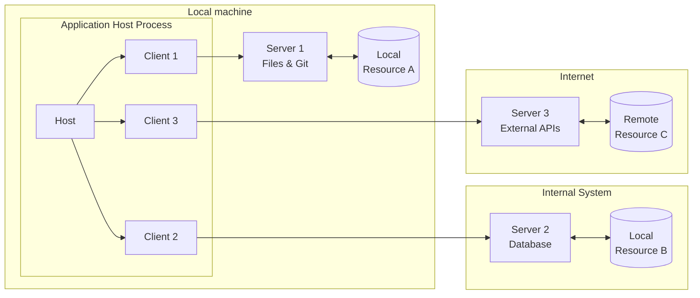
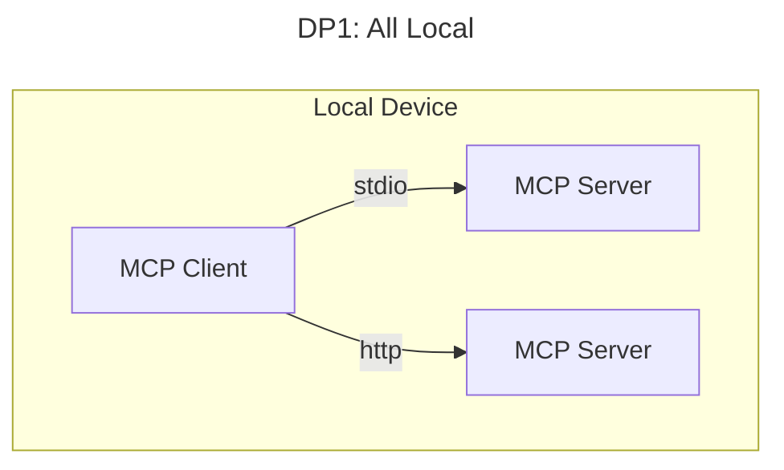
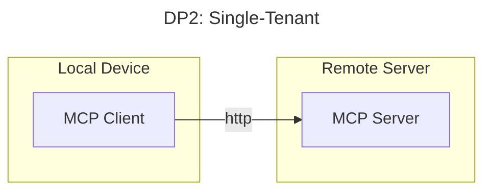
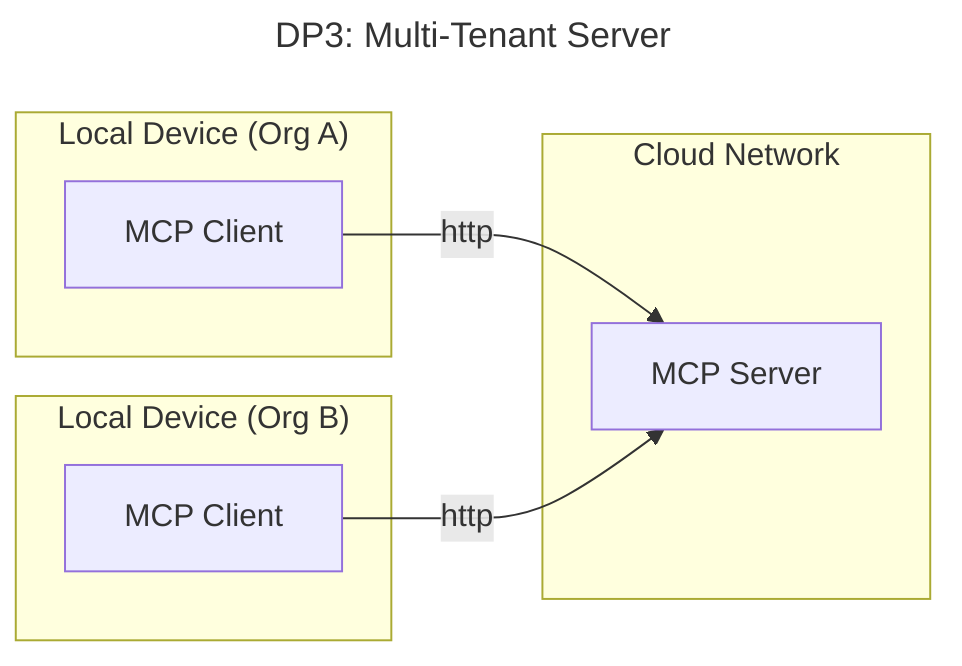

# Model Context Protocol (MCP) Security

Approved by the CoSAI Project Governing Board on 8 January 2026.

# Table of contents
  - [Abstract](#abstract)
    - [Scope](#scope)
    - [Anti-scope](#anti-scope)
    - [Target Audience](#target-audience)
  - [1. MCP Overview](#1-mcp-overview)
    - [1.1 MCP Architecture](#11-mcp-architecture)
      - [1.1.1 MCP Deployment Patterns](#111-mcp-deployment-patterns)
  - [2. MCP Threat Model](#2-mcp-threat-model)
    - [2.1 Threat Landscape and Methodology](#21-threat-landscape-and-methodology)
    - [2.2 Why MCP Requires a Different Approach](#22-why-mcp-requires-a-different-approach)
  - [3. MCP Threats](#3-mcp-threats)
    - [3.1 MCP Specificity](#31-mcp-specificity)
      - [3.1.1 MCP Specific](#311-mcp-specific)
      - [3.1.2 MCP Contextualized](#312-mcp-contextualized)
    - [3.2 Controls and Mitigations](#32-controls-and-mitigations)
      - [3.2.1 Agent Identity](#agent-identity)
      - [3.2.2 Secure Delegation and Access Control](#secure-delegation-and-access-control)
      - [3.2.3 Input and Data Sanitization and Filtering](#input-and-data-sanitization-and-filtering)
      - [3.2.4 Cryptographic Integrity and Remote Attestation](#324-cryptographic-integrity-and-remote-attestation)
      - [3.2.5 Sandboxing and Isolation](#sandboxing-and-isolation)
      - [3.2.6 Cryptographic Verification of Resources](#cryptographic-verification-of-resources)
      - [3.2.7 Transport Layer Security](#transport-layer-security)
      - [3.2.8 Secure Tool and UX Design](#secure-tool-and-ux-design)
      - [3.2.9 Human-in-the-loop](#329-human-in-the-loop)
      - [3.2.10 Logging](#logging)
      - [3.2.11 Lifecycle and Governance](#lifecycle-and-governance)
    - [3.3 Security Assurance Profiles](#33-security-assurance-profiles)
      - [3.3.1 Level Definitions](#331-level-definitions)
      - [3.3.2 Control Requirements by Level](#332-control-requirements-by-level)
      - [3.3.3 Threat Coverage Summary](#333-threat-coverage-summary)
      - [3.3.4 Deployment Pattern Mapping](#334-deployment-pattern-mapping)
      - [3.3.5 Applying Profiles in Practice](#335-applying-profiles-in-practice)
      - [3.3.6 Emerging Standards](#336-emerging-standards)
      - [3.3.7 Open Questions](#337-open-questions)
- [4. Conclusion](#4-conclusion)
- [5. Contributors and Acknowledgements](#5-contributors-and-acknowledgements)
- [6. Appendix](#6-appendix)
  - [6.1 Deployment Pattern (DP) Security Considerations](#61-deployment-pattern-dp-security-considerations)
    - [6.1.1 Deployment Pattern 1: All-Local](#611-deployment-pattern-1-all-local)
    - [6.1.2 Deployment Pattern 2: Single-Tenant MCP Server](#612-deployment-pattern-2-single-tenant-mcp-server)
    - [6.1.3 Deployment Pattern 4: Multi-Tenant MCP Server](#613-deployment-pattern-4-multi-tenant-mcp-server)
    - [6.2 Threat Details](#62-threat-details)
      - [MCP-T1: Improper Authentication and Identity Management](mcp-t1-improper-authentication-and-identity-management)
      - [MCP-T2: Missing or Improper Access Control](#mcp-t2-missing-or-improper-access-control)
      - [MCP-T3: Input Validation/Sanitization Failures](#mcp-t3-input-validationsanitization-failures)
      - [MCP-T4: Input/Instruction Boundary Distinction Failure](#mcp-t4-inputinstruction-boundary-distinction-failure)
      - [MCP-T5: Inadequate Data Protection and Confidentiality Controls](#mcp-t5-inadequate-data-protection-and-confidentiality-controls)
      - [MCP-T6: Missing Integrity/Verification Controls](#mcp-t6-missing-integrityverification-controls)
      - [MCP-T7: Session and Transport Security Failures](#mcp-t7-session-and-transport-security-failures)
      - [MCP-T8: Network Binding/Isolation Failures](#mcp-t8-network-bindingisolation-failures)
      - [MCP-T9: Trust Boundary and Privilege Design Failures](#mcp-t9-trust-boundary-and-privilege-design-failures)
      - [MCP-T10: Resource Management/Rate Limiting Absence](#mcp-t10-resource-managementrate-limiting-absence)
      - [MCP-T11: Supply Chain and Lifecycle Security Failures](#mcp-t11-supply-chain-and-lifecycle-security-failures)
      - [MCP-T12: Insufficient Logging, Monitoring, and Auditability](#mcp-t12-insufficient-logging-monitoring-and-auditability)
  - [6.3 MCP Threats and Vulnerabilities](#63-mcp-threats-and-vulnerabilities)
    - [6.3.1 Conventional Security](#631-conventional-security)
  - [6.4 CoSAI Focus](#64-cosai-focus)
  - [6.5 Guidelines on usage of more advanced AI systems (e.g. large language models (LLMs), multi-modal language models. etc) for drafting documents for OASIS CoSAI](#65-guidelines-on-usage-of-more-advanced-ai-systems-eg-large-language-models-llms-multi-modal-language-models-etc-for-drafting-documents-for-oasis-cosai)
  - [6.6 Copyright Notice](#66-copyright-notice)

# Abstract

Since its emergence a year ago, MCP has rapidly established itself as the protocol for transmitting structured context between AI agents and services. Given the growing importance and attack surface of MCP and agentic systems, it is imperative that deployment specific security threats are identified and improvements are made to address the challenges and ambiguities inherent in MCP implementations. Our primary goal is to share actionable security guidance for today's MCP implementations while identifying areas where the protocol and ecosystem may need to evolve to address emerging threats. We introduce short and medium-term security implications related to MCP through the introduction of twelve core threat categories and almost forty threats. Our taxonomy distinguishes between traditional security threats amplified by AI and MCP, and novel attack vectors. For each threat and category, we propose mitigations, defenses, and best practices for using MCP across multiple deployment scenarios including enterprise use cases. Multiple critical CVEs have been reported and incidents such as data leakage have already occurred across MCP/agentic deployments. Several examples are mentioned with links in section 2.1.

## Scope

This paper focuses on the security aspects of MCP implementations, covering:

* Security analysis of [the June](https://modelcontextprotocol.io/specification/2025-06-18) (2025-06-18) and [latest](https://modelcontextprotocol.io/specification/2025-11-25) revised specification MCP transport and protocol layers
* Threat modeling strategies for MCP-based agentic systems[^1]
* Supply chain security considerations for MCP servers and tools
* Identity and access management challenges in agentic architectures consuming MCP endpoints
* Best practices for secure MCP deployment and operation
* Recommendations for protocol enhancements to address identified security gaps

We are collaborating with Anthropic and the MCP maintainer community to ensure our recommendations are practical and implementable. This work also coordinates with CoSAI's Software Supply Chain Security workstream to ensure comprehensive coverage of agentic system security concerns.

## Anti-Scope

This paper does not address:

* Content safety, misinformation, or AI ethics concerns unrelated to security
* General AI model safety or alignment issues beyond their security implications
* Detailed implementation of specific security tools (we provide guidance, not implementation).  Follow on papers will provide reference implementations and recommendations for specific mitigation controls.
* Non-security aspects of MCP performance, scalability, or functional capabilities
* Legal or regulatory compliance requirements (though our recommendations may support compliance efforts). For these matters, see the assets being created from our [Workstream 3: AI Risk Governance](https://github.com/cosai-oasis/ws3-ai-risk-governance).

## Target Audience

Primary audience:

- **Security professionals and developers securing, creating or connecting to MCP servers**. This includes developers, security practitioners, enterprise architects, and organizations who are implementing, deploying, or integrating MCP servers and clients into their agentic AI systems.
- (longer term) MCP maintainers, the broader MCP ecosystem including contributors to MCP implementations and tooling, and the core protocol developers at Anthropic and beyond

## Status: Draft

# 1. MCP Overview

[MCP](https://modelcontextprotocol.io/introduction) is an open standard developed by Anthropic and a growing open source community that provides a structured framework for connecting large language models and AI agents to external tools, data sources, and services. MCP addresses a fundamental challenge in agentic AI systems: how to enable models to access and interact with real-world resources dynamically while maintaining security and reliability through standardization. MCP simplifies AI application integration with databases, APIs, file systems, web services, and other external resources reducing the need for custom integrations for each tool or service.

MCP operates through a client-server architecture where AI applications (hosts) use MCP clients to establish connections with MCP servers that expose specific capabilities such as tools, resources, and prompts. The protocol defines standardized methods for:

* discovering available capabilities including tools or services
* invoking parametrized services
* accessing data resources

MCP supports multiple transport mechanisms including standard I/O (stdio) for local processes and Streamable HTTP for networked communications, enabling flexible deployment scenarios from local development environments to distributed cloud architectures.[^2]

## 1.1 MCP Architecture

MCP follows a client-server architecture where host applications (such as AI assistants, IDEs, or workflow automation tools) use MCP clients to connect to local or remote MCP servers. Each client-server connection operates as a dedicated, stateful session that begins with initialization and capability negotiation. Communication is built on JSON-RPC, which defines the message format and protocol semantics including lifecycle management and core primitives (tools, resources, and prompts). The transport layer handles the delivery of these JSON-RPC messages between clients and servers, supporting stdio for local processes and Streamable HTTP for remote servers.

### 1.1.1 MCP Deployment Patterns

MCP servers can be deployed across diverse environments with varying trust relationships and security implications. The security posture of an MCP deployment depends on several intersecting factors: where the server code originates (first-party, open source, third-party), where it executes (local machine, internal infrastructure, external cloud), and what resources it can access (local files, enterprise systems, external services).

Each deployment pattern creates distinct trust boundaries that fundamentally shape the threat model. Local deployments using `stdio` transport provide process-level isolation but require careful management of file system access. Internal network deployments using Streamable HTTP must consider lateral movement risks and authentication requirements. External cloud deployments introduce internet-facing attack surfaces and multi-tenancy concerns.

1. **All-Local**: The MCP client and server are co-located leveraging stdio or http transports
2. **Single-Tenant Hybrid**: The MCP client connects to a single-tenant hosted MCP server over http. The MCP client may run locally or be hosted remotely.
3. **Multi-Tenant Cloud**: MCP clients from multiple tenants connect to a shared MCP server.

These deployment patterns each carry a distinct threat model based on the trust boundaries between client and server. Threat models differ by which components are trusted or untrusted, single- vs. multi-tenant setups, and local vs. remote deployments.A deeper analysis of the security implications of each is presented in the Appendix.

# 2. MCP Threat Model

## 2.1 Threat Landscape and Methodology

As with many newly adopted technologies there are numerous examples of significant security incidents across MCP deployments.

* **Asana AI incident** (May 2025): Tenant isolation flaw allowed cross-organization data contamination affecting up to 1,000 enterprises. ([Read more](https://www.upguard.com/blog/asana-discloses-data-exposure-bug-in-mcp-server))
* **WordPress Plugin vulnerability**: Over 100,000 sites affected by privilege escalation via MCP in AI Engine plugin, patched June 18, 2025 ([Read more](https://nvd.nist.gov/vuln/detail/CVE-2025-5071))
* **Supabase MCP Issue** Researchers demonstrated how prompt injection via support ticket data could cause AI tools like Cursor to expose private tables through a connected MCP server with direct database access, exploiting excessive tools and overprivilege. ([Read more](https://supabase.com/blog/defense-in-depth-mcp))

This section examines current threats through documented incidents and establishes a threat model addressing MCP's unique interdependency challenges.

## 2.2 Why MCP Requires a Different Approach

While there are numerous, high quality frameworks addressing AI risk (e.g. MITRE ATLAS, NIST AI RMF, MAESTRO, etc.) MCP introduces fundamentally new security considerations:

* Protocol-level authentication between AI clients and tool servers
* Dynamic capability negotiation that determines what tools AI can access
* Distributed trust relationships across multiple independent tool providers
* Session management complexities unique to long-lived AI conversations

Though existing frameworks are designed to assess complex multi-component systems, they assume components behave predictably according to predefined logic. MCP places an LLM, an agent whose behavior is shaped by natural language input, at the center of security-critical decisions, requiring a fundamentally different threat model.

# 3. MCP Threats

This framework organizes nearly forty threats to MCP deployments across twelve distinct categories, spanning the full technology stack—from foundational identity and access controls through AI-specific boundary failures to supply chain and operational visibility requirements. This model enables security teams to prioritize defenses based on the specific threats and attack surfaces relevant to their deployment. The taxonomy distinguishes between traditional security concerns amplified by AI mediation and novel attack vectors unique to LLM-tool interactions, providing clear guidance for implementing defense-in-depth strategies across the MCP ecosystem.

The first set of risk categories (T1–T2) covers foundational identity and access control risks critical to understanding the origins of a request and how it is being executed through the complex interactions of agents and tools. Next are threats related to input handling stemming from both traditional and AI-specific threats (T3–T4), protection of data and code confidentiality and integrity (T5–T6), and network and transport security (T7–T8). Lastly, MCP risks go beyond a protocol and reference implementation, and spans the MCP lifecycle, including how organizations use and manage MCP capabilities: managing trust relationships (T9), governing resources (T10), ensuring secure supply chains (T11), and maintaining visibility (T12).

## 3.1 MCP Specificity

The broad applicability and diverse deployment models and supported transports results in a large number of applicable threats. Threats are divided into three tiers:

* **Tier 1 \- MCP Specific Threats (7 Threats)**: Novel risks and threats due to MCP’s architecture and design decisions.
* **Tier 2 \- MCP Contextualized Threats (8 Threats)**: known threats that manifest differently in MCP contexts or are amplified in MCP deployments
* **Tier 3 \- Conventional Threats (19 Threats)**: security threats are are broadly applicable or derive from legacy, infrastructure, or transport implementation decisions

The table below organizes the threats by category and provides a mapping to controls and mitigations, discussed next.

| Threat | Threat Category | MCP Specific | MCP Contextualized | Conventional Security | Control and Mitigation |
| :---- | :---- | :---- | :---- | :---- | :---- |
| [MCP-T1](#mcp-t1-improper-authentication-and-identity-management) | Improper Authentication and Identity Management  | [1. Identity Spoofing](#identity-spoofing) | [8. Confused Deputy (OAuth Proxy)](#privilege-escalation) | [16. Credential Theft/Token Theft](#credential-theft)   [17. Replay Attacks/Session Hijacking](#replay-attacks)  [18. OAuth/Legacy Auth Weaknesses](#auth-weakness)  [19. Session Token Leakage](#token-leakage) | [Agent Identity](#agent-identity)  [Secure Delegation (i.e. OAuth delegation)](#secure-delegation-and-access-control)  |
| [MCP-T2](#mcp-t2-missing-or-improper-access-control) | Missing or Improper Access Control  |  | [9. Insecure Human-in-the-Loop](#hil) [10. Improper Multitenancy](#improper-multitenancy) | [8. Privilege Escalation](#privilege-escalation)   [20. Excessive Permissions/Overexposure](#excessive-permissions) | [Secure Delegation Access Control](#secure-delegation-and-access-control)  |
| [MCP-T3](#mcp-t3-input-validationsanitization-failures) | Input Validation/Sanitization Failures |  |  | [21. Command Injection](#command-injection)   [22. File System Exposure/Path Traversal](#path-traversal)   [23. Insufficient Integrity Checks](#insufficient-integrity-checks) | [Data Sanitization Guardrails](#input-and-data-sanitization-and-filtering)  [Sandboxing and Isolation](#sandboxing-and-isolation)  ([Roots](https://modelcontextprotocol.io/specification/2025-06-18/client/roots) support)  |
| [MCP-T4](#mcp-t4-inputinstruction-boundary-distinction-failure) | Data/Control Boundary Distinction Failure  | [2. Tool Poisoning](#tool-poisoning)   [3. Full Schema Poisoning](#fsp)   [4. Resource Content Poisoning](#resource-content-poisoning) | [11. Prompt Injection](#prompt-injection)  | [21. Command Injection](#command-injection) | [Input Sanitization, Guardrails Context Isolation](#input-and-data-sanitization-and-filtering) |
| [MCP-T5](#mcp-t5-inadequate-data-protection-and-confidentiality-controls) | Inadequate Data Protection and Confidentiality Controls |  |  | [24. Data Exfiltration & Corruption](#data-exfiltration)   [22. File System Exposure/Path Traversal](#path-traversal) | [Sandboxing and Isolation](#sandboxing-and-isolation)   [Access Control](#secure-delegation-and-access-control)   [Guardrails](#input-and-data-sanitization-and-filtering) |
| [MCP-T6](#mcp-t6-missing-integrityverification-controls) | Missing Integrity/Verification Controls | [4. Resource Content Poisoning](#resource-content-poisoning)   [5. Typosquatting/Confusion Attacks](#typosquatting)   [6. Shadow MCP Servers](#shadow-mcp) |  | [25. Supply Chain Compromise and Privileged host-base Attacks](#supply-chain)  | [Cryptographic Integrity Remote Attestation MCP server integrity](#cryptographic-verification-of-resources) |
| [MCP-T7](#mcp-t7-session-and-transport-security-failures) | Session and Transport Security Failures |  | [12. Man-in-the-Middle (MITM)](#mitm) | [26. Unrestricted Network Access](#unrestricted-network)   [27. Protocol Security Gaps](#protocol-security)   [28. Insecure Descriptor Handling](#insecure-descriptor)   [23. Insufficient Integrity Checks](#insufficient-integrity-checks)   [29. CSRF Protection Missing](#csrf)   [30. CORS/Origin Policy Bypass](#cors) | [Network and Transport Security](#transport-layer-security) |
| [MCP-T8](#mcp-t8-network-bindingisolation-failures) | Network Binding/Isolation Failures | [6. Shadow MCP Servers](#shadow-mcp) | [10. Improper Multitenancy](#improper-multitenancy) | [31. Malicious Command Execution](#malicious-command-execution)   [32. Dependency/Update Attack](#dependency-update-attack)   [26. Unrestricted Network Access](#unrestricted-network) | [Network and Transport Security](#transport-layer-security)   [Sandboxing and Isolation](#sandboxing-and-isolation) |
| [MCP-T9](#mcp-t9-trust-boundary-and-privilege-design-failures) | Trust Boundary and Privilege Design Failures | [7. Overreliance on the LLM](#overreliance) | [13. Consent/User Approval Fatigue](#user-fagitue) |  | [Secure tool design UX Design](#secure-tool-and-ux-design) |
| [MCP-T10](#mcp-t10-resource-managementrate-limiting-absence) | Resource Management/Rate Limiting Absence |   | [14. Resource exhaustion and denial of wallet](#resource-exhaustion) | [33. Payload Limit/DoS](#payload-limit) | [Network and Transport Security](#transport-layer-security) |
| [MCP-T11](#mcp-t11-supply-chain-and-lifecycle-security-failures) | Supply Chain and Lifecycle Security Failures | [6. Shadow MCP Servers](#shadow-mcp) |  | [25. Supply Chain Compromise](#supply-chain) | [Lifecycle Governance](#lifecycle-and-governance) |
| [MCP-T12](#mcp-t12-insufficient-logging-monitoring-and-auditability) | Insufficient Logging, Monitoring, and Auditability |  | [15. Invisible Agent Activity](#invisible-agent) | [34. Lack of Observability](#lack-of-observability) | [Logging](#logging)   [Lifecycle Governance](#lifecycle-and-governance) |

### 3.1.1 MCP Specific

1. **Identity Spoofing** Weak or misconfigured authentication in MCP deployments could allow attackers to impersonate legitimate clients or the agents acting on their behalf, corrupting audit trails or gaining unauthorized access to server resources. 
2. **Tool Poisoning** Malicious modification of tool metadata, configuration, or descriptors injected into clients via the tools/list method. This can cause AI agents or MCP components to invoke, trust, or execute compromised tools, potentially leading to data leaks or system compromise. As the MCP specification notes, 'descriptions of tool behavior such as annotations should be considered untrusted, unless obtained from a trusted server' ([Key Principles](https://modelcontextprotocol.io/specification/draft/index#key-principles)), making tool poisoning a recognized risk when clients connect to unvetted servers. 
3. **Full Schema Poisoning (FSP)** Attackers compromise entire tool schema definitions at the structural level, injecting hidden parameters, altered return types, or malicious default values that affect all subsequent tool invocations while maintaining apparent compatibility and evading detection by appearing legitimate to monitoring systems.  Unlike Tool Poisoning (\#2): Goes beyond poisoning individual tool metadata to compromise the entire structural definition and type system of tools.
4. **Resource Content Poisoning** Attackers embed hidden malicious instructions within data sources (databases, documents, API responses) that MCP servers retrieve and provide to LLMs, causing the poisoned content to execute as commands when processed, effectively achieving persistent prompt injection through trusted data channels rather than direct user input. Unlike Prompt Injection (\#12): Malicious instructions are embedded in backend data sources, not user-provided prompts. Unlike Tool Poisoning (\#2): Poisons the actual data/content retrieved by tools, not the tool definitions themselves. This attack surface may be expanded with transitive or composed MCP server calls. 
5. **Typosquatting/Confusion Attacks** Malicious actors create MCP servers or tools with names/descriptions similar to legitimate ones, tricking clients or AI agents into invoking harmful tools due to naming confusion or LLM hallucination. The MCP specification provides guidance on making tool origins and inputs visible to users and recommends human-in-the-loop approval for tool invocations ([User Interaction Model](https://modelcontextprotocol.io/specification/draft/server/tools#user-interaction-model)), but consent fatigue—where users reflexively approve prompts without careful review—can significantly undermine these protections. 
6. **Shadow MCP Servers** Unauthorized, unmonitored, or hidden MCP server instances create blind spots, increasing risk of undetected compromise and covert data exfiltration. These servers pose governance and compliance risks and may be malicious or easily compromised. 
7. **Overreliance on the LLM** MCP server developers may implement overly permissive tools, assuming the LLM will invoke them correctly and safely. However, model-level controls (trained refusals, safety classifiers, etc.) are not ironclad—even capable models can be manipulated through prompt injection, make errors in judgment, or be replaced with weaker models that lack equivalent safeguards. 

### 3.1.2 MCP Contextualized

8. **Privilege Escalation via Authentication and Authorization Bypass** Attackers exploit misconfigured roles, credentials, ACLs, trust relationships, or flawed delegation logic to gain elevated permissions and access unauthorized resources. In MCP deployments, this includes privilege escalation, as well as attacks that leverage the MCP server's intermediary role in multi-user token delegation. For example, confused deputy attacks can occur when an MCP server acting as an OAuth proxy fails to properly validate authorization context—allowing attackers to manipulate the server into using another user's credentials to perform privileged operations.  See the [official MCP guidance on preventing Confused Deputy attacks](https://modelcontextprotocol.io/specification/2025-06-18/basic/security_best_practices#confused-deputy-problem). 
9. **Insecure Human-in-the-Loop** Missing or insufficient human-in-the-loop consent checks can allow an MCP server to take risky actions not authorized by the user. 
10. **Improper Multitenancy** An attacker may exploit weak isolation between tenants or users, such as shared memory between processes, sessions,  or secrets and credentials, to access or manipulate unauthorized data. 
11. **Prompt Injection** LLMs have insufficient boundaries between input data and instructions. Attackers craft malicious inputs to manipulate LLMs or MCP components to perform unintended or harmful actions such as data exfiltration, privilege escalation, or unauthorized command execution. These malicious instructions can be sent *directly* to the LLM (e.g., via Sampling or when the MCP tool uses its own LLM) or *indirectly* by embedding instructions in prompts, resources, or tool metadata. This threat exists whenever untrusted input can reach the LLM's context window. 
12. **Man-in-the-Middle (MITM)** Exploiting insecure network transport (lack of TLS, improper certificate validation, or missing mutual authentication) to intercept, modify, or reroute data between MCP components, enabling data theft or manipulation. 
13. **Consent/User Approval Fatigue** Flooding users with excessive consent or permission prompts, causing habituation and leading to blind approval of potentially dangerous or malicious actions. 
14. **Resource exhaustion and denial of wallet** Attackers trigger an excessive number of LLM, tool, or other API calls leading to unexpected costs or resource exhaustion and denial of service. 
15. **Invisible Agent Activity** Agents or servers operate covertly, mimicking valid workflows but executing malicious or unauthorized actions without detection. 

Conventional security threats to MCP, and definitions of the twelve threat categories, are discussed in the Appendix.

## 3.2 Controls and Mitigations

### 3.2.1 Agent Identity

All requests should be traceable across the entire execution chain: the end user or initiating agent, any intermediate MCP servers, and the tools or services that performed the resulting actions. Standards are emerging to define the identity of agents and servers. One of these is SPIFFE / SPIRE, which provides cryptographic workload identities that can be granted authorization to resources. The SPIFFE ID can be used in token exchange as the subject or actor depending on the flow.

Secure identity, authentication, and authorization across the agentic and MCP ecosystem is an extremely active area of research and development. We will provide a much deeper analysis of the problem space in a subsequent white paper.

### 3.2.2 Secure Delegation and Access Control

To mitigate against privilege escalation, MCP servers should operate with the minimum privileges necessary. OAuth provides a widely adopted framework for secure delegation, with extensions that support fine-grained scope control and secure token flows (see [MCP Authorization](https://modelcontextprotocol.io/specification/2025-06-18/basic/authorization#authorization-flow)).

* Leverage existing identity providers to provide user authentication using standards such as OIDC
* Register MCP server as clients with the IAM provider. If the registration cannot happen a priori, then use Dynamic Client Registration
* Do not [passthrough the OAuth tokenss](https://modelcontextprotocol.io/specification/2025-06-18/basic/security_best_practices#token-passthrough) provided by the user
* Perform token exchange with the authorization server to provide full accountability ([RFC8693](https://datatracker.ietf.org/doc/html/rfc8693))
* Reduce scopes for least privilege, such as removing write scopes when only read access is required ([SEP-835](https://github.com/modelcontextprotocol/modelcontextprotocol/pull/835) adds native support to define scopes in 2025-11-25 MCP specification)
* User short-liven tokens and support proof-of-possession (DPoP) to prevent replay attacks ([RFC9449](https://datatracker.ietf.org/doc/html/rfc9449))
* Fine grained authorizations, through Rich Authorization Requests ([RFC9396](https://datatracker.ietf.org/doc/html/rfc9396)), limit requests to specific resources or tool parameters

All endpoint services should implement robust access control models, such as role-based access control (RBAC) or attribute-based access control and evaluate against claims made by the identity provider, such as role membership, job title, or work location. Additionally, robust policy languages including Open Policy Agent (OPA), Cedar, or OpenFGA provide robust, flexible, and secure protections.

### 3.2.3 Input and Data Sanitization and Filtering

A secure implementation of MCP requires strong data sanitization, input validation, and guardrails to protect against malicious or unsafe data inputs. Existing best practices for securing other RPC protocols should be applied.

All inputs should be strictly validated using allowlists at every trust boundary, with particular attention to sanitizing file paths through canonicalization, employing parameterized queries for database operations, and applying context-aware output encoding appropriate to each execution context (SQL, shell, HTML). Tool developers can include cryptographic checks, such as message authentication codes, digital signatures and encryption to ensure the end-to-end integrity and confidentiality of tools and resources.

LLM guardrails should treat all AI-generated content as untrusted input requiring the same rigorous validation as direct user input, deploying prompt injection detection systems that analyze patterns and structured formats (strict JSON schemas) to maintain clear boundaries between instructions and data. This includes all data returned from MCP servers including tool and resource definitions, resources, prompts, elicitation requests, and tool responses.

### 3.2.4 Cryptographic Integrity and Remote Attestation

Hardware Trusted Execution Environments (TEE) like Intel TDX, and AMD-SEV/SNP provide stronger isolation and can provide protection against runtime tampering of trusted servers, such as tool poisoning due to server compromise. Combined with remote attestation, TEEs can  isolate MCP servers and clients from compromised hardware, malicious administrators of server infrastructure, and certain classes of co-tenancy threats. For containerized deployments, consider the use of confidential containers (CoCo) that run containers in TEEs, and use remote attestation to verify the trustworthiness of the TEEs and what is running in them.

| Threat Category | How TEE \+ Remote Attestation provide Mitigation |
| :---- | :---- |
| MCP T5: Inadequate Data Protection and Confidentiality Controls      | MCP Client  and MCP Servers are isolated from other software running on the hardware, and also from the operator of the hardware, by running them in TEEs.    Insider and privileged access to the TEEs is prevented there by minimizing the attack vectors for this threat. Good system design should include other controls for verifying the attestations, and delivery of secrets and sensitive data via secure channels to the MCP Clients and Servers running in attested TEEs.    Compromised and/or Malicious co-tenant cannot access or tamper with Client and MCP Server code or data that is running inside TEEs. Additional controls would be necessary to ensure the data is protected in-transit and at-rest with tenant-specific keys, and RA-TLS, etc.  With end to end data protection designs built on TEEs, Identity credentials, access tokens, keys and secrets can be protected from compromise and exposure.    Compromised or Incorrect (or shadow) MCP Server launched in TEEs have different sets of measurements, and these will fail to attest, and MCP Client can refuse to interact with the MCP Servers.  Credentials and access tokens will not be provided to the MCP Servers.  TEEs however cannot mitigate against vulnerabilities in the running code, and should be complemented with runtime controls. (Seccomp, Apparmor, etc.) |
| MCP T9: Trust Boundary and Privilege Design Failures | Privileged software host-based attacks will not affect the MCP Client and the MCP Servers when they are running in TEEs. The host system, host OS, host firmware and the host Hypervisor are outside the Trust Boundary of the TEEs. However, sophisticated host-based attacks that include certain physical attacks on the hardware are not mitigated by TEEs. |

Complement the use of TEEs with other sandboxing and isolation technologies.

### 3.2.5 Sandboxing and Isolation

Agents and MCP servers should be executed with least privilege. MCP servers that interact with the host environment (e.g. by accessing files, running commands, issuing network connections), or that execute LLM-generated code, should always run in a sandbox to mitigate against potential safety and security threats.

 LLM-generated code and commands may contain hallucinations, bugs, or vulnerabilities, and should not run with full user privileges. MCP servers are commonly deployed in containers for ease of use, but containers should not be relied upon as a strong security boundary. Consider additional sandboxing (gVisor, Kata Containers, SELinux sandboxes) for stronger isolation.

### 3.2.6 Cryptographic Verification of Resources

Organizations developing MCP servers must provide cryptographic signatures and software bill of materials (SBOMs) for all server code to verify provenance. Organizations deploying MCP clients and servers should obtain and verify the contents and cryptographic signatures prior to deployment, and have policies restricting the approved sources and signing keys. TLS should be used to protect all data in transit. Remote attestation can further verify that servers are running expected code in a trusted environment. When supported, end-to-end cryptographic signatures can prove the authenticity of resources returned by MCP servers.

### 3.2.7 Transport Layer Security

MCP is structured around distinct communication layers that facilitate robust interaction between systems. At the transport layer, MCP leverages two primary communication methods:

* **stdio Transport:**
  A direct, pipe-based stream communication channel, typically used for intra-process or tightly integrated inter-process communications. JSON-RPC messages flow directly via standard input/output streams. This transport is most commonly used for local servers.

* **HTTP Streaming Transport:**
  A generalized HTTP-based transport channel supporting bidirectional JSON-RPC communication via streamed request-response patterns. This transport is most commonly used for remote servers.

At the higher-level protocol layer, MCP employs JSON-RPC 2.0 to standardize the formatting and processing of commands and responses communicated across these transport channels. JSON-RPC ensures structured messaging, enabling interoperability and clarity of communication across diverse platforms.

However, these transport and protocol layers, when improperly secured or configured, can expose MCP clients and servers to multiple vulnerabilities. The following table summarizes critical missing security controls across MCP’s layers and transports, along with specific exploits enabled by each gap:

| RequiredSecurity Control | Protocol | Example Exploits |
| ----- | ----- | ----- |
| Payload Limits | All Transports | Large payload and recursive payload DoS |
| Client-Server Authentication/Authorization | HTTP-based Transports | Impersonation, pre-init commands, unauthorized RPC calls |
| Downstream Authentication/Authorization | All Transports | Impersonation, pre-init commands, unauthorized RPC calls |
| Mutual TLS Authentication | HTTP-based Transports | Impersonation attacks |
| TLS Encryption | HTTP-based Transports | Stream tampering, TLS downgrade |
| Cross-Origin (CORS) | HTTP-based Transports | Cross-origin data leaks |
| CSRF Protection | HTTP-based Transports | Forged POST requests |
| Secure Descriptor Handling | stdio Transport | Hijacking via inherited descriptors |
| Integrity Checks | All Transports | Replay, spoofing, poisoned responses |

Implementing the above controls across transport and protocol layers significantly reduces the attack surface of MCP deployments.

For deployments handling long-lived sensitive data (biometrics, identity roots, classified material), classical asymmetric key exchange is vulnerable to "Harvest Now, Decrypt Later" (HNDL) attacks from future quantum adversaries. Organizations in this situation should plan migration to hybrid post-quantum TLS — combining classical X25519 with NIST FIPS 203 ML-KEM-768 — to protect data whose sensitivity extends beyond the quantum computing horizon. See the companion addendum, [*Quantum-Resistant AI Infrastructure: Implementing Post-Quantum Cryptography in MCP Architectures*](Addendum-MCP-and-PQC.md), for a detailed implementation roadmap.

### 3.2.8 Secure Tool and UX Design

Tool and UX design represent a critical security control point in Model Context Protocol (MCP) deployments. While much attention is paid to model safety and prompt injection defenses, the tools that agents invoke are often the actual execution surface where security boundaries are crossed and sensitive operations are performed. Poor tool design can undermine even the most robust authentication and authorization controls by creating overly permissive capabilities or delegating security-critical decisions to the LLM itself.

Each tool should have a single, clearly defined purpose with explicit boundaries on what it can and cannot do. When possible, create use-case driven or purpose-built tools, avoiding excessively powerful tools, e.g., execute a prepared statement versus executing any SQL statement. Tool implementations should not rely on the LLM to perform security-critical operations, validate inputs, or enforce constraints.

Safe and secure execution should not rely solely on the human user, who may not understand the security implications of frequent security prompts and can easily become fatigued. Security-relevant messages and elicitations should be clear, indicating the implications of the request, and unambiguous what is being requested.

### 3.2.9 Human-in-the-loop

There is the possibility that a large language model, legit or poisoned, decides to execute a tool in a dangerous way. MCP hosts and clients, in general, allow users to disable the confirmation prompt. There are two approaches organizations considering this risk unacceptable may implement to reduce its probability and impact:

* enforce the use of MCP hosts and clients with a configuration that unprivileged users cannot change and that keeps the confirmation prompt enabled.
* use [elicitation](https://modelcontextprotocol.io/specification/draft/client/elicitation) on the MCP server side to request the user confirmation of actions.

### 3.2.10 Logging

Implement at all layers (MCP host, client and server) the capability to store a log of what tools have been decided to use, with which parameters, and as a result of which prompt. Having a log of the decisions made is crucial in order to troubleshoot or perform forensics in case of a security event.

Leverage the use of centralization tools like MCP gateways or proxies, for example, between the MCP clients and the MCP servers, to centralize there key functionality (e.g. logging) and avoid the need to implement it on each component.

### 3.2.11 Lifecycle and Governance

Organizations must:

* implement mandatory code signing verification for all MCP servers before installation,
* use private package repositories with security scanning and approval workflows,
* deploy software composition analysis (SCA) tools to detect vulnerable dependencies,
* implement allow-lists of approved MCP servers with documented security reviews,
* Run MCP servers and clients in TEEs and use remote attestation to verify prior to interactions,
* use cryptographic hash verification for package integrity,
* and deploy binary authorization that prevents execution of unsigned or unverified code.

Supply chain security requires:

* implementing software bill of materials (SBOM) tracking for all MCP components,
* using dependency pinning with hash-based verification rather than version ranges,
* deploying automated vulnerability scanning for MCP servers and dependencies,
* implementing secure software development lifecycle (SSDLC) practices for internal MCP servers,
* using reproducible builds to verify package authenticity,
* and monitoring security advisories and CVE databases for known vulnerabilities in dependencies.

Lifecycle management demands:

*  maintaining centralized inventory of all deployed MCP servers with metadata (version, owner, purpose),
* implementing automated discovery to detect shadow or unauthorized MCP deployments,
* deploying lifecycle policies that automatically deprecate or remove outdated servers,
* using configuration management tools (Ansible, Puppet, Chef) to maintain consistent deployments,
* implementing rollback capabilities for problematic updates,
* and deploying update management processes with testing and staged rollout.

Operational practices include:

* regular security reviews and re-certification of approved MCP servers,
* automated scanning for shadow deployments across the organization,
* decommissioning procedures that ensure complete removal of deprecated servers,
* and version tracking with forced upgrade policies for servers with known vulnerabilities.

And, lastly, proper observability should be implemented across the stack to provide sufficient visibility to ensure compliance and enable developer debugging and incident investigation. Immutable records of actions and authorizations, such as token exchange implemented by an IDP (identity provider), provides accountability pertaining to who requested an action and how it was authorized. All interactions with the agent, tools, prompts, and models should be logged. OpenTelemetry provides end-to-end linkability of actions and is being widely adopted and integrated into many agentic tools and MCP servers and provides a consistent set of APIs and schemas.

## 3.3 Security Assurance Profiles

The preceding sections define twelve threat categories and their controls and mitigations. A flat list of controls, however, does not help practitioners determine which controls apply to their specific deployment. A sandbox experiment and a multi-tenant production system do not share the same threat surface. Applying uniform requirements causes friction: sandbox experiments stall under heavy compliance burdens, while production systems carry hidden risk due to under-investment.

Assurance profiles map specific security controls to specific deployment contexts. This section defines four assurance levels for MCP deployments. Each level specifies concrete control requirements across eight security dimensions, maps back to the MCP-T1 through MCP-T12 threat categories defined above (with cross-references to the [OWASP MCP Top 10](https://owasp.org/www-project-mcp-top-10/)), and aligns with the deployment patterns in Appendix 6.1. The [2026 MCP roadmap](https://blog.modelcontextprotocol.io/posts/2026-mcp-roadmap/) identifies enterprise readiness as a top priority; these profiles provide the security dimension of that effort.

The level numbering follows conventions used in frameworks like [SLSA](https://slsa.dev/spec/v1.0/): higher numbers indicate stronger assurance, and levels are cumulative (Level 3 includes everything in Level 2). Unlike [NIST SP 800-63](https://pages.nist.gov/800-63-4/sp800-63.html), which separates assurance across identity proofing (IAL), authentication (AAL), and federation (FAL), these profiles combine multiple security dimensions into a single deployment-oriented tier for operational simplicity.

### 3.3.1 Level Definitions

| Level | Alias | Intended Use | Trust Assumptions |
| :---- | :---- | :---- | :---- |
| Level 1 | Sandbox | Local development, single-user experiments, proof-of-concept work | Single user, no sensitive data, failures are recoverable. No access to production credentials or live data. |
| Level 2 | Internal | Internal enterprise deployments, team-shared environments, staging | Authenticated users within an organization. Moderate blast radius. Incidents must be diagnosable after the fact. |
| Level 3 | Production | Production workloads handling sensitive or business-critical data | Active threat surface. Data loss or unauthorized access has material business impact. Full auditability required. |
| Level 4 | Regulated | Multi-tenant platforms, adversarial environments, regulatory scope | Active adversaries assumed. Regulatory audit obligations. Strong tenant isolation and workload attestation required. |

### 3.3.2 Control Requirements by Level

#### Identity and Authentication

| Control | L1 | L2 | L3 | L4 |
| :---- | :---- | :---- | :---- | :---- |
| MCP client-server authentication | Implicit (local process via stdio) | MUST: [OAuth 2.1](https://modelcontextprotocol.io/specification/2025-11-25/basic/authorization) with PKCE for all remote server connections | MUST: OAuth 2.1 with PKCE, short-lived credentials, and [Client ID Metadata Documents](https://modelcontextprotocol.io/specification/2025-11-25/basic/authorization#client-registration) | MUST: OAuth 2.1 with PKCE, short-lived credentials, and enterprise-managed authorization where applicable |
| Agent identity | Not required | SHOULD: agents registered in a local inventory with unique identifiers | MUST: standardized workload identity (e.g., [SPIFFE / SPIRE](https://spiffe.io/) SVIDs) tied to specific code versions | MUST: workload identity with cryptographic attestation verifying the execution environment matches the declared manifest |
| User identity propagation | Not applicable | If acting on behalf of a user, SHOULD: preserve subject identity to downstream authorization components | MUST: [token exchange](https://datatracker.ietf.org/doc/html/rfc8693) carrying distinct `actor` (the agent) and `subject` (the human or initiating system) claims. For system-initiated workflows, a distinct workload identity may be used instead. | MUST: token exchange with delegation chain preserved for audit. Prior delegation hops should be retained for forensics, but authorization decisions must be based on the token's current actor and subject claims. |
| Credential storage | Local config acceptable. Real credentials discouraged; if production or user credentials are present, reclassify as Level 2. | MUST: OS keychain or secrets manager | MUST: secrets manager with automated rotation policy | MUST: long-lived private keys for signing and identity should be protected by hardware-backed or isolated keystores where available. Ephemeral access tokens must remain short-lived and runtime-confined. |
| Credential lifetime | Real credentials discouraged. If used, treat as Level 2. | SHOULD: bounded lifetime, rotation on schedule | MUST: short-lived tokens (minutes to hours) | MUST: short-lived sender-constrained credentials, typically minutes, bounded by transaction or task risk |

**Threat coverage:** MCP-T1 (Identity/Auth Failures), MCP-T2 (Authorization Errors)
**OWASP MCP mapping:** MCP01 (Token Mismanagement), MCP07 (Insufficient Auth)

#### Authorization and Delegation

| Control | L1 | L2 | L3 | L4 |
| :---- | :---- | :---- | :---- | :---- |
| Tool-level authorization | Not required | SHOULD: tool allowlists per agent role | MUST: ABAC/PBAC for tool access, supplemented by tool-based access control (TBAC) enforcing parameter-level constraints. TBAC evaluates the specific tool request against verifiable agent identity before execution. | MUST: TBAC with continuous real-time evaluation, anomaly detection, and automated revocation of compromised agent credentials |
| Scope management | No restriction | SHOULD: scoped permissions per server connection | MUST: least-privilege scopes; [incremental scope consent](https://modelcontextprotocol.io/specification/2025-11-25/basic/authorization) via `WWW-Authenticate` challenges rather than requesting maximal scopes upfront | MUST: structured authorization intent via [Rich Authorization Requests (RFC 9396)](https://datatracker.ietf.org/doc/html/rfc9396) using the `authorization_details` parameter for all sensitive tool operations |
| Delegation depth | Not applicable | SHOULD: defined maximum depth for agent chains | MUST: enforced depth limits with TTL constraints and audience restrictions | MUST: enforced depth limits, audience restrictions, and sender-constrained tokens at every hop |
| Token binding | Not required | Not required | MUST: sender-constrained tokens ([DPoP](https://datatracker.ietf.org/doc/html/rfc9449) or mTLS) for all delegated operations involving sensitive data | MUST: sender-constrained tokens with hardware-attested key material where platform supports it |
| Scope narrowing on delegation | Not applicable | SHOULD: scope narrows at each hop | MUST: scope narrows at each hop, cannot exceed delegating principal's effective permissions | MUST: scope narrows at each hop with cryptographic binding to transaction path |
| Audience restriction | Not required | SHOULD: audience (`aud`) claim validation on received tokens | MUST: [Resource Indicators (RFC 8707)](https://datatracker.ietf.org/doc/html/rfc8707) specifying the target MCP server's canonical URI. Authorization server must reject tokens where audience does not match. | MUST: Resource Indicators enforced globally, integrated with dynamic endpoint discovery via [Protected Resource Metadata (RFC 9728)](https://datatracker.ietf.org/doc/rfc9728/) |
| Token passthrough | Not applicable | MUST: MCP servers must not accept tokens intended for themselves and forward those same tokens to upstream APIs. See [MCP security best practices](https://modelcontextprotocol.io/specification/2025-06-18/basic/security_best_practices#token-passthrough). | MUST: downstream authentication managed exclusively via [token exchange (RFC 8693)](https://datatracker.ietf.org/doc/html/rfc8693) producing distinct, scoped tokens for each upstream resource | MUST: token exchange with sender-constrained bindings for all downstream calls |
| Human-in-the-loop | Warning on untrusted tools | MUST: explicit user confirmation for all destructive or state-mutating actions. MCP [elicitation](https://modelcontextprotocol.io/specification/2025-11-25/client/elicitation) provides a standardized mechanism for server-initiated user input requests. | MUST: configurable centralized approval policies with step-up authentication for high-impact actions | MUST: multi-party approval workflows for irreversible or high-value operations, with continuous context validation |

**Threat coverage:** MCP-T2 (Authorization Errors), MCP-T9 (Trust Boundary Failures)
**OWASP MCP mapping:** MCP02 (Privilege Escalation), MCP07 (Insufficient Auth)

#### Transport and Network Security

| Control | L1 | L2 | L3 | L4 |
| :---- | :---- | :---- | :---- | :---- |
| Transport encryption | Not required for stdio. Localhost HTTP acceptable. | MUST: TLS for all remote connections | MUST: TLS 1.3 and mTLS for server-to-server connections, certificate validation enforced | MUST: mTLS governed by workload identity federation (e.g., SPIFFE / SPIRE) and hardware trust anchors |
| Network binding | MUST for HTTP transport: bind exclusively to 127.0.0.1; binding to 0.0.0.0 is prohibited. stdio transport preferred. See [MCP transport security warning](https://modelcontextprotocol.io/specification/2025-06-18/basic/transports#security-warning). | MUST: explicit internal interface binding mapped to authenticated ingress. No 0.0.0.0. | MUST: network segmentation between MCP components | MUST: dedicated network segments, default-deny egress with explicit allowlists, proxy enforcement, and logging for outbound destinations |
| Origin and CSRF protection | MUST for HTTP transport: validate `Origin` header, validate `Host` header. Not applicable for stdio. | MUST: `Origin` validation, `Host` validation, and CSRF protections for all HTTP endpoints | MUST: strict origin policies with authentication required for all remote access | MUST: strict origin policies, additional request signing, and DNS pinning |
| Payload limits | Optional | MUST: defined payload size limits and basic recursion depth controls | MUST: enforced payload and recursion depth limits with per-session rate limiting | MUST: enforced limits with rate limiting per client/tenant and anomaly-based throttling |
| Message integrity | Not required | SHOULD: payload hashing and strict content-length validation | MUST: application-layer digital signatures (e.g., ECDSA P-256) over the full JSON-RPC message body | MUST: digital signatures with unique nonces and time-window validation to prevent replay |
| Local HTTP exposure | If using HTTP, MUST: validate `Origin`, bind to localhost only. stdio or Unix domain sockets preferred. Unauthenticated local HTTP is non-compliant above Level 1. | N/A (remote connections require authentication) | N/A | N/A |

**Threat coverage:** MCP-T7 (Session/Transport Failures), MCP-T8 (Network Binding Failures), MCP-T10 (Resource Management)
**OWASP MCP mapping:** MCP05 (Command Injection), MCP09 (Shadow Servers)

#### Isolation and Sandboxing

| Control | L1 | L2 | L3 | L4 |
| :---- | :---- | :---- | :---- | :---- |
| Execution isolation | SHOULD: execute within a restricted local user context. MUST NOT access production credentials or live data. | MUST: application sandboxing or containerized execution with resource limits | MUST: strong container isolation (e.g., gVisor, Kata Containers). No shared runtime across trust boundaries. | MUST: strong tenant isolation with attested workload identity. TEE / confidential containers should be used where threat model, regulation, or platform supports it. |
| Data isolation | Synthetic/mock data only. If production data is accessed, reclassify as Level 2+. | MUST: per-user data separation | MUST: per-tenant data isolation with encryption | MUST: per-tenant encryption with tenant-specific keys |
| Context isolation | Not required | SHOULD: scope cached tool outputs and context to the current user session | MUST: persistent context, memory, and cached tool outputs scoped to user, tenant, task, and agent boundary. Context from one workflow must not be reused in another without explicit policy authorization. | MUST: cross-tenant context sharing prohibited. Shared channels require redaction and release controls. |
| Snapshot and rollback | SHOULD: environment supports snapshot/rewind for experimentation | Optional | SHOULD: rollback capability for MCP server updates | MUST: rollback capability, staged rollouts, canary deployments |

**Threat coverage:** MCP-T5 (Data Protection), MCP-T8 (Network Binding Failures), MCP-T9 (Trust Boundary Failures)
**OWASP MCP mapping:** MCP10 (Context Over-Sharing)

#### Logging and Observability

| Control | L1 | L2 | L3 | L4 |
| :---- | :---- | :---- | :---- | :---- |
| Action logging | Optional, primarily for debugging | MUST: structured logging capturing tool identity, caller identity, policy decision, resource target, outcome, and correlation identifiers. Raw parameters and tool outputs must be logged only after redaction, hashing, or field-level tokenization. | MUST: comprehensive logging of tool invocations, authorization decisions, and security-relevant failures with full parameter redaction | MUST: immutable, tamper-evident logging of all interactions |
| Delegation chain logging | Not required | SHOULD: correlation IDs linking related events | MUST: full delegation chain reconstruction via correlation IDs, with scope, binding type, and audience at each hop | MUST: full delegation chain reconstruction with policy version, attestation state, and scope at each hop |
| Log schema | Freeform | SHOULD: structured format, mapped to OCSF or CEF | MUST: structured format mapped to OCSF or CEF with agentic extension fields (`delegation_path`, `attestation_state`, `correlation_id`) | MUST: structured format with mandatory agentic fields, correlated in SIEM with model, runtime, and infrastructure telemetry |
| Monitoring and alerting | Not required | SHOULD: centralized log aggregation | MUST: SIEM integration, anomaly detection on agent behavior | MUST: continuous monitoring, automated containment triggers, incident response hooks (kill-switch, tool disablement) |

**Threat coverage:** MCP-T12 (Logging Gaps)
**OWASP MCP mapping:** MCP08 (Lack of Audit and Telemetry)

#### Supply Chain and Lifecycle

| Control | L1 | L2 | L3 | L4 |
| :---- | :---- | :---- | :---- | :---- |
| Server provenance | Warning when running unverified servers | SHOULD: provenance checks for tool definitions and server packages | MUST: code signing verification before installation, SBOM tracking | MUST: code signing, SBOM, reproducible builds, binary authorization. Execution should be blocked for any server lacking a signed SBOM verified within a defined window. |
| Server inventory | Not required | SHOULD: documented inventory of deployed servers with owner and trust status. The [MCP Registry](https://modelcontextprotocol.io/specification/2025-11-25) provides a discovery mechanism for known servers. | MUST: centralized inventory with metadata (version, owner, purpose, allowed deployment environments) | MUST: centralized inventory with automated discovery of shadow deployments. Production environments must detect and alert on unregistered MCP servers. |
| Update management | No restriction | SHOULD: version tracking | MUST: dependency pinning with hash verification, vulnerability scanning | MUST: dependency pinning, automated scanning, staged rollout, forced upgrades for known CVEs |
| Decommissioning | Not required | SHOULD: documented removal process | MUST: complete removal of deprecated servers, credential revocation | MUST: automated lifecycle policies, downstream delegation revocation on decommission |

**Threat coverage:** MCP-T6 (Integrity/Verification), MCP-T11 (Supply Chain Failures)
**OWASP MCP mapping:** MCP03 (Tool Poisoning), MCP04 (Supply Chain Attacks), MCP09 (Shadow Servers)

#### Tool Definition, Input, and Output Integrity

Tool descriptions, parameter schemas, and return values are attack surfaces, not ordinary metadata. The [OWASP MCP Security Cheat Sheet](https://cheatsheetseries.owasp.org/cheatsheets/MCP_Security_Cheat_Sheet.html) and recent security research demonstrate that tool poisoning, schema corruption, and output-driven prompt injection are among the most effective attack vectors against MCP deployments. This dimension addresses MCP-T3 (Input Validation Failures) and MCP-T4 (Data/Control Boundary Failures).

| Control | L1 | L2 | L3 | L4 |
| :---- | :---- | :---- | :---- | :---- |
| Tool schema integrity | SHOULD: review tool descriptions and parameter schemas before use | SHOULD: pin trusted tool definitions and alert on changes | MUST: cryptographically pin approved tool definitions; changes require review and re-approval | MUST: signed tool-definition manifests with change approval and rollback. Unsigned definitions rejected at runtime. |
| Input validation | SHOULD: validate obvious dangerous inputs | MUST: strict JSON schema validation rejecting undeclared parameters (`additionalProperties: false`). Sanitize file paths against directory traversal. | MUST: enforce strict schemas, deny undeclared fields, validate file paths, URLs, and command parameters. Reject symlinks and prevent path traversal. | MUST: policy-aware validation with per-tool allowlists, deny rules, and deep content inspection for encoded command syntax |
| Output handling | SHOULD: treat tool output as untrusted | MUST: sanitize tool outputs before returning them to the model context when reused downstream | MUST: classify and sanitize tool output to prevent downstream prompt injection, SSRF, and command injection. Strip control characters and apply context-aware encoding. | MUST: content classification and policy enforcement before output may influence another tool, server, or agent |
| SSRF and traversal defense | Not required | MUST: restrict target URL schemes to HTTPS. Sanitize all file paths against directory traversal. | MUST: deny DNS resolution to loopback (127.0.0.0/8), link-local, and cloud metadata endpoints (169.254.169.254) | MUST: all network egress through strict allowlists managed by inspected egress proxies |

**Threat coverage:** MCP-T3 (Input Validation Failures), MCP-T4 (Data/Control Boundary Failures)
**OWASP MCP mapping:** MCP03 (Tool Poisoning), MCP05 (Command Injection), MCP06 (Prompt Injection via Context)

#### Session and Discovery Security

| Control | L1 | L2 | L3 | L4 |
| :---- | :---- | :---- | :---- | :---- |
| Session integrity | Not required | MUST: session identifiers must not be used as authenticators. Verify authorization on every request. Generate unpredictable session IDs bound to the authenticated principal. | MUST: session binding, expiration, and rotation according to risk. Stateful MCP servers must verify authorization per request. | MUST: session integrity with continuous re-evaluation and automated termination on anomaly detection |
| Authorization discovery | Not applicable (local) | SHOULD: support [OAuth Protected Resource Metadata (RFC 9728)](https://datatracker.ietf.org/doc/rfc9728/) for authorization server discovery | MUST: MCP servers expose Protected Resource Metadata. MCP clients use it for authorization server discovery. Should support incremental scope elevation via `WWW-Authenticate` challenges. | MUST: Protected Resource Metadata with [OIDC Discovery](https://openid.net/specs/openid-connect-discovery-1_0-final.html). Clients must support both discovery mechanisms. |
| Elicitation security | Not required | SHOULD: treat server-provided prompts and [elicitation requests](https://modelcontextprotocol.io/specification/2025-11-25/client/elicitation) as untrusted. Servers must not use form mode to request credentials. | MUST: elicitation and sampling flows isolated from privileged tool invocation unless policy explicitly allows coupling and logs it | MUST: elicitation-originated content treated as untrusted input requiring full validation before influencing tool parameters or execution |
| Refresh tokens | Not applicable | If issued, must be protected as confidential credentials and should be rotated | MUST: refresh tokens rotated, stored securely, and not treated as substitutes for runtime authorization at the MCP server | MUST: refresh token rotation enforced, with revocation propagated within defined SLA |

**Threat coverage:** MCP-T1 (Identity/Auth Failures), MCP-T7 (Session/Transport Failures)
**OWASP MCP mapping:** MCP01 (Token Mismanagement), MCP07 (Insufficient Auth)

### 3.3.3 Threat Coverage Summary

This matrix shows the minimum expected coverage per threat category at each level. [OWASP MCP Top 10](https://owasp.org/www-project-mcp-top-10/) categories are cross-referenced where applicable.

| CoSAI Threat Category | OWASP MCP Top 10 | L1 | L2 | L3 | L4 |
| :---- | :---- | :---- | :---- | :---- | :---- |
| MCP-T1: Identity/Auth Failures | MCP01, MCP07 | Partial | MUST | MUST | MUST |
| MCP-T2: Authorization Errors | MCP02, MCP07 | Partial | MUST | MUST | MUST |
| MCP-T3: Input Validation Failures | MCP05 | SHOULD | MUST | MUST | MUST |
| MCP-T4: Data/Control Boundary Failures | MCP03, MCP06 | Partial | SHOULD | MUST | MUST |
| MCP-T5: Data Protection | MCP10 | Partial (mock data) | MUST | MUST | MUST |
| MCP-T6: Integrity/Verification | MCP03, MCP04 | Not required | SHOULD | MUST | MUST |
| MCP-T7: Session/Transport Failures | MCP01 | SHOULD (localhost) | MUST | MUST | MUST |
| MCP-T8: Network Binding Failures | MCP09 | MUST (localhost bind) | MUST | MUST | MUST |
| MCP-T9: Trust Boundary Failures | MCP02 | Partial | MUST | MUST | MUST |
| MCP-T10: Resource Management | -- | Not required | MUST | MUST | MUST |
| MCP-T11: Supply Chain Failures | MCP04 | Not required | SHOULD | MUST | MUST |
| MCP-T12: Logging Gaps | MCP08 | Not required | MUST | MUST | MUST |

### 3.3.4 Deployment Pattern Mapping

| Deployment Pattern | Typical Level | Notes |
| :---- | :---- | :---- |
| DP1: All-Local (stdio) | Level 1 or 2 | Level 1 for personal experiments. Level 2 if handling internal data or if multiple users share the environment. |
| DP2: Single-Tenant Remote | Level 2 or 3 | Level 2 for internal tools. Level 3 when serving production workloads or sensitive data. |
| DP3: Multi-Tenant Cloud | Level 3 or 4 | Level 3 for standard SaaS. Level 4 when regulatory obligations apply or tenant isolation failures have material consequences. |

Deployment pattern alone does not determine the level. A local deployment (DP1) processing regulated health data should target Level 3 or higher regardless of its network topology. The level is a function of data sensitivity, blast radius, and regulatory context, not where the server runs.

### 3.3.5 Applying Profiles in Practice

Assurance levels define minimum viable security for specific deployment contexts. Organizations should select the appropriate tier based on data sensitivity and threat model, not treat Level 4 as a universal target.

**Token binding is a hard requirement at Level 3.** Without sender-constrained tokens, a compromised agent session can be replayed against downstream services. Teams operating at Level 3 without [DPoP](https://datatracker.ietf.org/doc/html/rfc9449) or mTLS binding are accepting a risk that contradicts the level's stated trust assumptions.

**Level 1 is data isolation, not "no security."** Level 1 does not require runtime process sandboxing (containers, chroot), but it prohibits access to production credentials, live data, and production endpoints. If a Level 1 deployment touches real credentials, it is miscategorized. This is a classification decision, not a configuration knob.

**Level transitions should be planned, not reactive.** A proof-of-concept that succeeds at Level 1 will be pushed toward production. Upgrading from Level 2 to Level 3 requires migrating from standard OAuth tokens to sender-constrained tokens (DPoP), implementing workload identity (e.g., SPIFFE / SPIRE SVIDs), enforcing TBAC on tool execution, and enabling continuous ABAC evaluation.

**OWASP Minimum Bar as a Level 2 prerequisite.** The [OWASP MCP Security Minimum Bar](https://genai.owasp.org/resource/a-practical-guide-for-secure-mcp-server-development/) defines strict deployment gates across five categories (identity, isolation, tooling, validation, deployment). Fulfilling those requirements is the prerequisite for achieving Level 2. Organizations that cannot pass the OWASP baseline should not deploy MCP servers in shared environments.

**Agent gateways for Level 3 and Level 4.** Embedding complex authorization, payload inspection, and identity management logic directly into individual MCP servers creates inconsistent security posture. Deployments targeting Level 3 and above should deploy a centralized proxy or agent gateway as the primary enforcement point for token validation, TBAC policy evaluation, workload identity exchange, and audit logging. Decoupling enforcement from tool execution ensures uniform compliance across heterogeneous server implementations.

**Profiles can be verified.** Each control in the matrix is testable. Future work should define automated checks (similar to SLSA verification tooling and tools like [mcp-scan](https://github.com/invariantlabs-ai/mcp-scan)) that validate whether a deployment meets a claimed level. Continuous verification is critical: a server deployed securely on Tuesday may be compromised via an upstream dependency update by Thursday. Level 3 deployments should integrate continuous scanning into deployment pipelines. Level 4 deployments should enforce binary authorization blocking servers without current signed SBOMs.

### 3.3.6 Emerging Standards

The agent identity and authorization landscape is evolving rapidly. The following standards and frameworks are informative references for implementers. As these mature, future profile revisions will incorporate them where appropriate.

* [AI Agent Authentication and Authorization](https://datatracker.ietf.org/doc/draft-klrc-aiagent-auth/) (`draft-klrc-aiagent-auth-01`, Kasselman et al., March 2026): Proposes a comprehensive model using [WIMSE](https://datatracker.ietf.org/wg/wimse/about/) architecture, SPIFFE identifiers, and OAuth extensions. Standardizes agents as workloads within the WIMSE framework. Relevant to the identity controls at Levels 3 and 4.

* [OAuth Identity and Authorization Chaining](https://datatracker.ietf.org/doc/html/draft-ietf-oauth-identity-chaining-08) (`draft-ietf-oauth-identity-chaining-08`): Formalizes cross-domain delegation, extending [RFC 8693](https://datatracker.ietf.org/doc/html/rfc8693) token exchange for multi-hop agent chains. Relevant to scope narrowing and delegation depth controls.

* [Transaction Tokens for A2A](https://datatracker.ietf.org/doc/html/draft-liu-oauth-a2a-profile-00) (`draft-liu-oauth-a2a-profile-00`): Provides an alternative to nested `act` claims for preserving call chain context in agent-to-agent communication. May address token size concerns in deep delegation chains.

* [OAuth SPIFFE Client Authentication](https://datatracker.ietf.org/doc/html/draft-ietf-oauth-spiffe-client-auth-00) (`draft-ietf-oauth-spiffe-client-auth-00`): Profiles SPIFFE SVIDs as OAuth client credentials, enabling agents to authenticate without client secrets. Relevant to Level 3+ credential management.

* [AGNTCY](https://agntcy.org/) (Linux Foundation): Provides reference implementations for Agent Identity Badges and Tool-Based Access Control (TBAC). The TBAC model is referenced in the authorization controls at Level 3+. See [#47](https://github.com/cosai-oasis/ws4-secure-design-agentic-systems/issues/47) and [#48](https://github.com/cosai-oasis/ws4-secure-design-agentic-systems/issues/48) for evaluation threads.

* **Post-Quantum Cryptography (NIST FIPS 203/204):** NIST has standardized ML-KEM (FIPS 203) for key encapsulation and ML-DSA (FIPS 204) for digital signatures. The US federal government requires CNSA 2.0 algorithm support for newly procured National Security Systems from January 2027, with full migration by 2033–2035. For MCP deployments, hybrid key exchange (X25519 + ML-KEM-768) is the current recommended approach for transport security, and ML-DSA replaces RSA/ECDSA for server identity signatures. See the companion addendum, [*Quantum-Resistant AI Infrastructure: Implementing Post-Quantum Cryptography in MCP Architectures*](Addendum-MCP-and-PQC.md), for data classification guidance, implementation examples, and a migration roadmap.

### 3.3.7 Open Questions

1. **Granularity within levels.** Some organizations may need finer distinctions within Level 3 (e.g., "production with PII" vs. "production without PII"). Should sub-levels be supported, or should the matrix stay at four tiers with policy-level refinements handling the edge cases?

2. **SIG alignment.** The agent lifecycle SIG discussion is exploring similar profile concepts for all agent types, not just MCP. These profiles should stay compatible with that broader direction. If the SIG adopts a different level taxonomy, this matrix should be updatable without structural rework.

3. **Regulatory mapping.** Level 4 currently describes regulatory scope in general terms. A dedicated regulatory compliance annex mapping specific obligations (California AI Transparency Act, EU AI Act, sector-specific requirements) to profile controls may be warranted as a separate deliverable.

4. **Evidence-per-level annex.** A one-page reference showing expected verification artifacts at each level (Protected Resource Metadata endpoint, token audience validation test, tool-definition hash manifest, sandbox config, egress policy, sample audit record, SBOM attestation, decommissioning proof) would make the profiles more actionable for audit teams. Deferred to a follow-up.

5. **MCP extensions and MCP Apps.** The [November 2025 specification](https://modelcontextprotocol.io/specification/2025-11-25) introduced an extensions system for capability negotiation, and [MCP Apps](https://blog.modelcontextprotocol.io/posts/2026-mcp-roadmap/) allow tools to return interactive HTML interfaces. Both introduce new attack surfaces (capability injection, XSS/sandbox escape) that future profile revisions should address.

# 4. Conclusion

 MCP adoption is accelerating, and security must keep pace. Our analysis reveals common vulnerabilities in deployments that lack adequate authentication, session management, and supply chain controls. Incidents in adjacent AI systems demonstrate these are active threats, not theoretical concerns.

Organizations deploying MCP-based systems must develop defense-in-depth strategies including zero-trust architectures, hardware-based isolation through trusted execution environments, rigorous supply chain vetting, and continuous monitoring. Organizations processing data with long operational lifespans should also begin planning for post-quantum cryptographic migration; see the companion addendum [*Quantum-Resistant AI Infrastructure*](Addendum-MCP-and-PQC.md) for implementation guidance. Securing MCP deployments requires coordinated effort across developers, organizations, and protocol maintainers—investment in security architecture now will pay dividends as agentic systems become more prevalent.

# 5. Contributors and Acknowledgements

**Workstream Leads**

* Sarah Novotny, ([sarah.novotny@gmail.com](mailto:sarah.novotny@gmail.com))
* Ian Molloy, IBM ([molloyim@us.ibm.com](mailto:molloyim@us.ibm.com))
* Raghu Yeluri, Intel ([raghuram.yeluri@intel.com](mailto:raghuram.yeluri@intel.com))
* Alex Polyakov, Adversa AI ([alex@adversa.ai](mailto:alex@adversa.ai))

**Editors**

* Daniel Rohrer, NVIDIA ([drohrer@nvidia.com](mailto:drohrer@nvidia.com))
* Jenn Newton, Anthropic ([jenn@anthropic.com](mailto:jenn@anthropic.com))
* David LaBianca, Google ([ddlb@google.com](mailto:ddlb@google.com))

**Contributors**

* Shrey Bagga, Cisco ([sbagga@cisco.com](mailto:sbagga@cisco.com))
* Damian Bogel, Google ([kele@google.com](mailto:kele@google.com))
* Florencio Cano, Red Hat ([fcanogab@redhat.com](mailto:fcanogab@redhat.com))
* John Cavanaugh, ProCap360 ([johncavanaugh@procap360.com](mailto:johncavanaugh@procap360.com))
* Jason Clinton, Anthropic ([j@anthropic.com](mailto:j@anthropic.com))
* Andre Elizondo, Wiz ([andre.elizondo@wiz.io](mailto:andre.elizondo@wiz.io))
* Riggs Goodman III, Amazon ([goriggs@amazon.com](mailto:goriggs@amazon.com))
* Hani Jamjoom, IBM ([jamjoom@us.ibm.com](mailto:jamjoom@us.ibm.com))
* Nik Kale, Cisco ([nikkal@cisco.com](mailto:nikkal@cisco.com))
* Chooi Low, Dell ([Chooi.Low@dell.com](mailto:Chooi.Low@dell.com))
* Victor Lu ([victorjunlu@gmail.com](mailto:victorjunlu@gmail.com))
* Michael Medeiros, Cisco ([mimedeir@cisco.com](mailto:mimedeir@cisco.com))
* Grant Miller, IBM ([millerg@us.ibm.com](mailto:millerg@us.ibm.com))
* David Pierce, PayPal ([davpierce@paypal.com](mailto:davpierce@paypal.com))
* Shriti Priya, IBM ([shritip@ibm.com](mailto:shritip@ibm.com))
* Xiaokui Shu, IBM ([xiaokui.shu@ibm.com](mailto:xiaokui.shu@ibm.com))
* Bill Stout, ServiceNow ([bill.stout@servicenow.com](mailto:bill.stout@servicenow.com))
* Moin Syed, Anthropic ([moin@anthropic.com](mailto:moin@anthropic.com))
* Josiah Hagen, TrendMicro ([josiah_hagen@trendmicro.com](mailto:josiah_hagen@trendmicro.com))
* Jonathan Whitson ([jonathan\_whitson@dell.com](mailto:jonathan_whitson@dell.com))
* Marina Zeldin, Dell ([marina.zeldin@dell.com](mailto:marina.zeldin@dell.com))
* Giulio Zizzo, IBM ([giulio.zizzo2@ibm.com](mailto:giulio.zizzo2@ibm.com))

**Technical Steering Committee Co-Chairs**

* Akila Srinivasan, Anthropic ([akila@anthropic.com](mailto:akila@anthropic.com))
* J.R. Rao, IBM ([jrrao@us.ibm.com](mailto:jrrao@us.ibm.com))

# 6. Appendix

## 6.1 Deployment Pattern (DP) Security Considerations

The following section examines the common deployment patterns and their security implications in more detail.

### 6.1.1 Deployment Pattern 1: All-Local

**MCP Client:** 	localhost 
**MCP Server:** 	localhost 
**Transport:**		stdio | http

All-local deployment security is entirely dependent on the host system's posture and a general-purpose desktop or laptop with standard user software, internet connectivity, and physical access exposes the MCP server to the same attack vectors: malware execution, credential theft, supply chain compromise through installed packages, and physical device access.

With `stdio` transport, the MCP server runs as a subprocess of the host application, typically sharing the same user privileges and security context. This model trades network segmentation and centralized security controls for simplicity and direct access to local tools. It is well-suited for development workflows, trusted personal tools, and scenarios requiring direct local system access. However, for production deployments handling sensitive data or serving multiple users, the lack of isolation and dependence on host security may be insufficient depending on organizational risk tolerance and compliance requirements.

**Security Implications**:

* Exposes local system to potentially malicious or compromised servers
* Execution control: Inherits host's security posture
* Data access control: inherits host's data posture

**Security Recommendations**:

* Appropriate for development and personal use
* Use `stdio` to avoid DNS rebinding risks: `stdio` transport is strongly recommended for local MCP as this eliminates [DNS rebinding risks that can occur with HTTP-based transports on local servers](https://modelcontextprotocol.io/specification/2025-06-18/basic/transports#security-warning)
* Use sandboxing to limit privilege escalation attacks: MCP servers locally requires a sandbox to prevent privilege escalation attacks

### 6.1.2 Deployment Pattern 2: Single-Tenant MCP Server

**MCP Client:** 	localhost 
**MCP Server:** 	single-tenant remote host 
**Transport:** 		http

MCP deployment model where the client runs locally but connects to a single-tenant MCP server in the cloud. Provides users with local tools (file access, development utilities) and remote capabilities (API access, shared resources, centralized data).

Note: Authentication between client and server **is required** to establish the trust boundary.

**Security Implications**:

* Security of the remote MCP server depends on cloud infrastructure controls rather than local host posture
* Client security has similar implications toDeployment Pattern1 as it is running locally

**Security Recommendations**:

* Secure Credential Storage: clients should use secure credential storage (OS keychains, secret managers) to protect MCP server authentication tokens
* Authenticated and Encrypted: communication between local and cloud components must be authenticated and encrypted
* Secure Servers and Discovery: enterprise clients should enforce authenticated server discovery and maintain explicit allowlists (ex. via MDM)

### 6.1.3 Deployment Pattern 4: Multi-Tenant MCP Server

**MCP Client:** 	cloud-hosted or locally-hosted 
**MCP Server:** 	PaaS or SaaS provided 
**Transport:** 		http

An MCP deployment model where a service provider runs an MCP server and provides access to multiple tenants. The MCP server could serve its own tools, prompts, and resources or provide an MCP tool interface to an existing service, API, or application.

**Security Implications**:

* Requires robust tenant isolation, identity, and access control
* Improper isolation may lead to leakage of sensitive data or privilege escalation

**Security Recommendations**:

* MCP server developers must implement strong multi-tenancy controls (e.g., per-tenant encryption, RBAC).
* Select MCP servers hosted directly by the service provider (e.g., use GitHub’s MCP server for GitHub access instead of a third-party server)
* Provide remote attestation for MCP servers when possible

## 6.2 Threat Details

### MCP-T1: Improper Authentication and Identity Management

**Technical Description**: Absence of authentication mechanisms, insecure credential storage practices, and inadequate identity verification within MCP implementations. The protocol's optional authentication model combined with the common practice of storing multiple service credentials (OAuth tokens, API keys, database passwords) in centralized MCP servers creates high-value targets. MCP servers may accumulate credentials without cryptographic protection, secure storage standards, or credential rotation policies. See the official MCP documentation for [additional](https://modelcontextprotocol.io/docs/tutorials/security/authorization#common-pitfalls-and-how-to-avoid-them) [guidance](https://modelcontextprotocol.io/specification/2025-06-18/basic/authorization#token-theft).

**Architectural Impact**: Improper agent identity and authentication leads to impersonation and replay attacks, preventing the MCP server and endpoints from correctly identifying the identity of the originating request, and a confused deputy. The insecure storage of authentication credentials across users and services fundamentally alters the security posture. Weak or absent authentication enables unauthorized server access, credential harvesting, token theft, and persistent access.

**Vulnerability Examples**: Credential exposure in configuration files, OAuth token theft, authentication bypass, lack of multi-factor authentication, insecure credential storage, static client ID vulnerabilities, authentication mechanism implementation flaws

### MCP-T2: Missing or Improper Access Control

**Technical Description**: Absence of authorization mechanisms, improper enforcement of object-level permissions, and insufficient capability-based access control within the MCP specification. The protocol lacks native support for fine-grained authorization checks, role-based access control (RBAC), and privilege separation. MCP servers commonly request and receive overly broad permission scopes to maximize flexibility, while implementations fail to verify user permissions for individual objects, resources, or operations.

**Architectural Impact**: Enables unauthorized data access, privilege escalation, and lateral movement across connected services. The optional nature of authorization combined with developers' tendency to grant excessive permissions leads to inconsistent security postures

**Vulnerability Examples**: Broken Object Level Authorization (BOLA), privilege abuse, overbroad permissions, insufficient authorization checks, context bleeding, cross-tenant data exposure, function-level access control failures, configuration file exposure.

### MCP-T3: Input Validation/Sanitization Failures

**Technical Description**: Absence of input validation, sanitization, and parameterization across multiple injection contexts including command execution, database queries, file system operations, and serialization boundaries. This vulnerability class encompasses traditional injection flaws exacerbated by the false sense of security provided by AI mediation. Developers incorrectly assume that user input processed through an LLM is inherently safe, bypassing established secure coding practices, when in reality the LLM transforms but doesn't sanitize malicious payloads.

**Architectural Impact**: Enables command injection, SQL injection, LDAP injection, XML injection, path traversal, and deserialization attacks with potentially catastrophic consequences. Can be combined with other threats (MCP-T4) for increased impact.

**Vulnerability Examples**: Command injection, SQL injection, remote code execution (RCE), path traversal, LDAP injection, XML injection, deserialization vulnerabilities, unsafe file operations

### MCP-T4: Input/Instruction Boundary Distinction Failure

**Technical Description**: This design limitation enables the entire class of prompt injection vulnerabilities, including direct injection, indirect injection through tool / schema descriptions, and context manipulation attacks. LLMs lack syntactic or semantic mechanisms to differentiate between control instructions and data payloads. This fundamental limitation stems from the continuous token stream processing model, where both trusted system prompts and untrusted user data are processed within the same computational context without clear demarcation. The absence of a control plane/data plane separation at the architectural level means any adversary-controllable input—including tool responses, schema descriptions, and resource content—can potentially alter the execution flow of the AI system.

**Architectural Impact**:  Attackers can embed malicious instructions in seemingly benign content (emails, documents, API responses) that, when processed by the LLM, execute unauthorized actions. The blurring of boundaries between viewing content and executing commands creates attack vectors where reading a document can trigger data exfiltration, system compromise, or unauthorized API calls through MCP tools.

**Vulnerability Examples**: Prompt injection (direct and indirect), tool poisoning (TPA), full schema poisoning (FSP), advanced tool poisoning (ATPA), resource content poisoning, hidden prompt embedding (Unicode attacks), malicious message crafting

### MCP-T5: Inadequate Data Protection and Confidentiality Controls

**Technical Description**: Insufficient encryption, inadequate secrets management, and absence of data protection standards for sensitive information in transit, at rest, and during processing. MCP implementations commonly expose personally identifiable information (PII), financial data, and intellectual property without proper encryption, data classification, or access segmentation.

**Architectural Impact**: Creates significant data exposure risks where attackers gaining partial access can perform correlation attacks across services to build comprehensive user profiles, enabling sophisticated spear-phishing, extortion, or identity theft. The concentration of access to disparate services in a single protocol layer violates the security principle of segregation, allowing data leakage through logging, error messages, debug output, and traffic inspection. Without encryption and proper secrets management, sensitive data remains vulnerable throughout its lifecycle.

**Vulnerability Examples**: Unencrypted credential storage, sensitive data exposure in logs, PII leakage

### MCP-T6: Missing Integrity/Verification Controls

**Technical Description**: Absence of cryptographic integrity verification mechanisms for MCP servers, clients, tool definitions, message authenticity, configuration immutability, and behavioral attestation. The protocol lacks provisions for code signing, integrity verification, message authentication codes, reproducible builds, and tamper-evident logging, enabling undetected modification of critical system components. Permits tool behavior mutation, configuration tampering, message forgery, launch and execution of compromised/shadow MCP servers and clients and supply chain attacks.

**Architectural Impact**: Without integrity verification, malicious actors can modify tool definitions post-deployment, alter configuration files after approval, and inject malicious updates without detection

**Vulnerability Examples**: Rug Pull Attack, Tool Shadowing, Tool Name Spoofing, MCP Configuration Poisoning

### MCP-T7: Session and Transport Security Failures

**Technical Description**: Systematic weaknesses in session lifecycle management and transport security including insecure session identifier transmission, absence of session binding mechanisms, lack of secure session storage standards, insufficient transport encryption enforcement, and inadequate session termination controls.

**Architectural Impact**: Enables session hijacking, replay attacks, session fixation, man-in-the-middle attacks, and cross-site request forgery.

**Vulnerability Examples**: Session management flaws, session hijacking, replay attacks, insufficient timeout policies, man-in-the-middle attacks, insecure transport protocols

### MCP-T8: Network Binding/Isolation Failures

**Technical Description**: Architectural deficiencies in network isolation including improper network interface binding, absence of network segmentation requirements, vulnerability to DNS rebinding attacks, and lack of defense-in-depth network controls. MCP implementations commonly bind to all available interfaces (0.0.0.0) rather than localhost, exposing internal services to external networks. The protocol lacks specifications for network-level security boundaries, proper CORS policies, and protection against cross-origin attacks.

**Architectural Impact**: Exposes internal services to external networks, enables lateral movement within compromised environments, and permits DNS rebinding attacks that bypass same-origin policies.

**Vulnerability Examples**: Localhost bypass (NeighborJack), DNS rebinding attacks, improper network interface binding, insufficient network segmentation, cross-origin vulnerabilities, exposure of internal services, lateral movement exploitation

### MCP-T9: Trust Boundary and Privilege Design Failures

**Technical Description**: Fundamental architectural flaw wherein the protocol assumes an optimistic trust model between the MCP client and server or an MCP server and third-party API or service.

**Architectural Impact**: Creates cascading security failures where compromise of a single component leads to complete system breach. Enables privilege escalation, lateral movement across service boundaries, and complex attack chains exploiting transitive trust relationships.

**Vulnerability Examples**: Overreliance on an LLM, confused deputy, cross-tenant exposure, over-reliance on human-in-the-loop

### MCP-T10: Resource Management/Rate Limiting Absence

**Technical Description**: Lack of resource consumption controls, quota management systems, and economic attack prevention mechanisms. The protocol provides no specifications for token limits, context size boundaries, API call quotas, computational resource allocation, or cost management, enabling resource exhaustion and economic denial-of-service attacks

**Architectural Impact**: Facilitates denial-of-service through token exhaustion, context window overflow, and API quota depletion. Enables economic attacks where minimal attacker investment causes disproportionate financial damage through excessive LLM API consumption. The absence of resource controls can lead to unexpected costs, high latency, and denial of service.

**Vulnerability Examples:** Denial of Wallet, Denial of Service , MCP Resource Exhaustion, MCP Recursive Task Exhaustion,  Large Context Payload DoS

### MCP-T11: Supply Chain and Lifecycle Security Failures

**Technical Description:** Absence of secure software supply chain practices for MCP server acquisition, installation, updates, and lifecycle management. The protocol lacks standardized mechanisms for verifying server provenance, validating package integrity before installation, or maintaining inventory of deployed MCP servers across an organization. MCP servers are commonly downloaded from third-party repositories without cryptographic verification, installed without security review, and remain operational indefinitely without lifecycle management. Organizations face risks from shadow MCP servers deployed without authorization, zombie servers that remain active after deprecation, and malicious packages masquerading as legitimate tools in public repositories.

**Architectural Impact**: Creates pre-deployment and operational security gaps distinct from runtime integrity issues. Attackers can distribute malicious MCP servers through popular repositories, compromise legitimate packages during distribution, or exploit the absence of inventory management to deploy unauthorized servers. Shadow deployments bypass security controls entirely, and the absence of centralized inventory prevents detection of unauthorized MCP infrastructure across the enterprise.

**Vulnerability Examples:** Malicious MCP package distribution, compromised package repositories, shadow server deployments, zombie/deprecated servers, typosquatting in package names, package substitution attacks, unsigned server distributions, unvetted community packages, lack of security review processes

### MCP-T12: Insufficient Logging, Monitoring, and Auditability

**Technical Description**: Absence of standardized audit logging, comprehensive traceability mechanisms, and security monitoring capabilities within MCP implementations. Without robust logging of MCP server connections, tool invocations, authorization decisions, and data access patterns, organizations face significant compliance blind spots and inability to perform forensic analysis of security incidents.

**Architectural Impact:** Severely impairs incident detection, response capabilities, and post-incident forensics. Organizations cannot trace AI agent actions back to their source, establish accountability for security breaches, or identify patterns indicating compromise or abuse.Compliance frameworks requiring audit trails and accountability mechanisms cannot be satisfied, creating regulatory risks and limiting the ability to meet security certification requirements.

**Vulnerability Examples**: Insufficient audit logging, lack of security telemetry, inability to trace attack chains, missing forensic capabilities, inadequate anomaly detection, undetected shadow servers, compliance violations, absence of accountability mechanisms, blind spots in security visibility

## 6.3 MCP Threats and Vulnerabilities

### 6.3.1 Conventional Security

16. **Credential Theft /Token Theft** Attackers exploit insecure storage, handling, or transmission of secrets (OAuth tokens, API keys, credentials), enabling impersonation, unauthorized access, or privilege escalation. 
17. **Replay Attacks/Session Hijacking** Attackers intercept, reuse, or hijack authentication tokens or session identifiers, impersonating legitimate users or agents and executing unauthorized actions. 
18. **OAuth/Legacy Auth Weaknesses** Use of outdated, weak, or pass-through authentication and authorization (e.g., basic auth, static API keys) exposes systems to impersonation, privilege misuse, and poor accountability. 
19. **Session Token Leakage** Exposure or insecure handling of session tokens across MCP components leads to unauthorized access, impersonation, or session hijacking. 
20. **Excessive Permissions/Overexposure** AI agents, MCP servers, or tools are granted more privileges than necessary, increasing risk of abuse or compromise in case of attack or misconfiguration. 
21. **Command Injection** Unvalidated or unsanitized user inputs, prompts, or tool arguments lead to execution of unauthorized system commands, resulting in data compromise or system takeover. 
22. **File System Exposure/Path Traversal** Improper validation of file paths or tool arguments enables access to or exfiltration of files outside intended directories, exposing credentials and sensitive data. 
23. **Insufficient Integrity Checks** Absence of signature or integrity validation on MCP messages and responses enables replay, spoofing, or delivery of poisoned results. 
24. **Data Exfiltration & Corruption** Attackers leverage MCP components to steal or corrupt sensitive data, reroute messages, or manipulate outputs, often via compromised servers or poisoned tools. 
25. **Supply Chain Compromise** Malicious or compromised MCP servers, dependencies, or packages are introduced into the environment, enabling attackers to execute arbitrary code, exfiltrate data, or persist within the infrastructure. 
26. **Unrestricted Network Access** MCP servers or clients with open outbound or inbound network access can download malicious payloads, exfiltrate data, or connect to command-and-control infrastructure. Malicious or compromised MCP servers allow attackers to move laterally using stored credentials and exploiting poor network segmentation and isolation. 
27. **Protocol Security Gaps** Weaknesses in MCP protocol/transport layers (e.g., missing payload limits, no TLS, unauthenticated requests) enable DoS, spoofing, or unauthorized command execution. 
28. **Insecure Descriptor Handling** Improper management of transport descriptors (e.g., stdio) allows attackers to hijack or interfere with data streams and process communications. 
29. **CSRF Protection Missing** Lack of Cross-Site Request Forgery (CSRF) controls on HTTP/SSE transports enables attackers to forge or replay unauthorized requests. 
30. **CORS/Origin Policy Bypass** Missing or weak cross-origin policies allow unauthorized data leaks via cross-origin resource sharing (CORS) in browser-based or web transports. 
31. **Malicious Command Execution** Compromised or rogue MCP servers execute arbitrary or malicious payloads (ransomware, data manipulation) triggered by crafted prompts or files. 
32. **Dependency/Update Attack** Attackers compromise MCP dependencies or update channels (e.g., “rug pull” attacks), swapping benign code for malicious versions after trust is established. MCP servers may also introduce new capabilities (e.g., tools or prompts) that have not been vetted or approved for use. 
33. **Payload Limit/DoS** Unrestricted payload sizes or recursion depth in protocols enable denial-of-service via resource exhaustion. 
34. **Lack of Observability** Insufficient logging, monitoring, or attribution across MCP actions hides malicious or unintended activity, hindering detection and response. 

## 6.4 CoSAI Focus

CoSAI is an OASIS Open Project, bringing together an open ecosystem of AI and security experts from industry-leading organizations. The project is dedicated to sharing best practices for secure AI deployment and collaborating on AI security research and product development. The scope of CoSAI is specifically focused on the secure building, integration, deployment, and operation of AI systems, with an emphasis on mitigating security risks unique to AI technologies. Other aspects of Trustworthy AI are deemed important but beyond the scope of the project including, ethics, fairness, explainability, bias detection, safety, consumer privacy, misinformation, hallucinations, deep fakes, or content safety concerns like hateful or abusive content, malware, or phishing generation. By concentrating on developing robust measures, best practices, and guidelines to safeguard AI systems against unauthorized access, tampering, or misuse, CoSAI aims to contribute to the responsible development and deployment of resilient, secure AI technologies.

## 6.5 Guidelines on usage of more advanced AI systems (e.g. large language models (LLMs), multi-modal language models. etc) for drafting documents for OASIS CoSAI:

tl;dr: CoSAI contributions are actions performed by humans, who are responsible for the content of those contributions, based on their signed OASIS iCLA (and eCLA, if applicable). \[Each contributor must confirm whether they are entitled to donate that material under the applicable open source license; OASIS and the CoSAI Project do not separately confirm that.\] Each contributor is responsible for ensuring that all contributions comply with these AI use guidelines, including disclosure of any use of AI in contributions.

* Selection of AI systems: CoSAI recommends the use of reputable AI systems (lowering the risk of inadvertently incorporating infringing material).
* Model constraints: Currently, CoSAI or OASIS are not required to have a contract or financial agreement for using AI systems from specific vendors. However, CoSAI editors should consider employing varying tools to avoid potential fairness concerns among vendors.
* IP infringement: It is the responsibility of the individual who subscribes/prompts and receives a response from an AI system to confirm they have the right to repost and donate the content to OASIS under our rules.
* Transparency: CoSAI’s goal will be to maintain transparency throughout the process by documenting substantial use of AI systems whenever possible (e.g., the prompts and the AI system used), and to ensure that all content, regardless of production by human or AI systems, was reviewed and edited by human experts. This helps build trust in the standards development process and ensures accountability.
* Human-edited content and quality control: CoSAI mandates human-reviewed or \-edited results for any final outputs. A robust quality control process should be in place, involving careful review of the generated content for accuracy, relevance, and alignment with CoSAI's goals and principles. Human experts should scrutinize the output of AI systems to identify any errors, inconsistencies, or potential biases.
* Iterative refinement: The use of AI systems in drafting standards should be seen as an iterative process, with the generated content serving as a starting point for further refinement and improvement by human experts. Multiple rounds of review and editing may be necessary to ensure the final standards meet the required quality and reliability thresholds.

## 6.6 Copyright Notice

Copyright © OASIS Open 2025. All Rights Reserved. This document has been produced under the process and license terms stated in the OASIS Open Project rules: [https://www.oasis-open.org/policies-guidelines/open-projects-process](https://www.oasis-open.org/policies-guidelines/open-projects-process).

This document and translations of it may be copied and furnished to others, and derivative works that comment on or otherwise explain it or assist in its implementation may be prepared, copied, published, and distributed, in whole or in part, without restriction of any kind, provided that the above copyright notice and this section are included on all such copies and derivative works. The limited permissions granted above are perpetual and will not be revoked by OASIS or its successors or assigns. This document and the information contained herein is provided on an "AS IS" basis and OASIS DISCLAIMS ALL WARRANTIES, EXPRESS OR IMPLIED, INCLUDING BUT NOT LIMITED TO ANY WARRANTY THAT THE USE OF THE INFORMATION HEREIN WILL NOT INFRINGE ANY OWNERSHIP RIGHTS OR ANY IMPLIED WARRANTIES OF MERCHANTABILITY OR FITNESS FOR A PARTICULAR PURPOSE. OASIS AND ITS MEMBERS WILL NOT BE LIABLE FOR ANY DIRECT, INDIRECT, SPECIAL OR CONSEQUENTIAL DAMAGES ARISING OUT OF ANY USE OF THIS DOCUMENT OR ANY PART THEREOF. The name "OASIS" is a trademark of OASIS, the owner and developer of this document, and should be used only to refer to the organization and its official outputs. OASIS welcomes reference to, and implementation and use of, documents, while reserving the right to enforce its marks against misleading uses. Please see [https://www.oasis-open.org/policies-guidelines/trademark/](https://www.oasis-open.org/policies-guidelines/trademark/) for above guidance.

This is a Non-Standards Track Work Product. The patent provisions of the OASIS IPR Policy do not apply.

[^1]:  Agentic System Definition \- An agentic system is an AI-powered solution that autonomously handles one or more tasks within a business workflow, replacing human decision-making nodes with automated processes that can range from simple single-task agents to complex networks of interconnected AI agents working together. The scope and sophistication of an agentic system directly correlates with both its potential economic value and operational risk, as organizations can choose to automate anything from individual yes/no decisions to entire business functions depending on their risk tolerance and automation goals.

[^2]:  Server-Sent Events (SSE) over HTTP has been deprecated in the 2025-06-18 revision of the MCP.
