# Zero-Trust Tool Invocation Standard
## Universal Metadata Layer for Secured Remote Execution

**Version:** 1.2.0  
**Status:** Draft  
**Framework Alignment:** CoSAI-RM, MITRE ATLAS, OWASP Top 10 for LLM

---

## Abstract

Tool invocation in agentic AI systems is remote code execution. This standard defines a **protocol-agnostic metadata layer** that cryptographically binds authorization to execution parameters, eliminating the vulnerability window between user intent and tool execution.

The pattern works with—not against—existing protocols (MCP, AP2, OAuth 2.x) by providing a security envelope that any framework can implement.

---

## The Fundamental Problem

```mermaid
flowchart LR
    subgraph traditional[" "]
        A1[OAuth] --> A2[Token] --> A3["Tool(params*)"]
    end
    
    subgraph zerotrust[" "]
        B1[OAuth] --> B2["Token(H(params))"] --> B3[Tool]
    end
    
    traditional ==>|bind| zerotrust

    subgraph legend[" "]
        L1["H = cryptographic hash"]
        L2["· ad-hoc at approval (MCP)"]
        L3["· pre-defined server-side (AP2/mandates)"]
        L4["· PKI/DPoP optional transport binding"]
    end

    style traditional fill:none,stroke:#aaa,stroke-dasharray:3
    style zerotrust fill:none,stroke:#333,stroke-width:2px
    style legend fill:none,stroke:#ccc,stroke-dasharray:2
```



**The vulnerability:** Traditional authorization grants broad permissions. Parameters flow unvalidated from agent interpretation to tool execution.

**The solution:** Cryptographic hash binding at authorization time. Parameters become immutable "code" that cannot be modified post-approval.

---

## Axioms

### Axiom 1: Parameter Integrity
```
H(approved_params) == H(executed_params)
```
The hash of parameters approved by the user MUST equal the hash of parameters executed by the tool. Any deviation indicates tampering or misinterpretation.

### Axiom 2: Atomic Consumption
```
consume(token.jti) → {success: once, failure: always}
```
Each authorization token MUST be consumable exactly once via atomic operation. Replay is impossible by construction.

### Axiom 3: Temporal Binding
```
now() ∈ [token.nbf, token.exp]
```
Authorization is valid only within a defined temporal window. Default: 30 seconds.

### Axiom 4: Identity Binding
```
token.sub == authenticated_user.id
token.tool == requested_tool.name
```
The token MUST bind a specific identity to a specific tool. No delegation, no scope expansion.

### Axiom 5: Hash Provenance (Protocol Agnostic)
```
H(params) := {
  ad-hoc:      client-generated at user approval (MCP model)
  pre-defined: server-generated at mandate definition (AP2 model)
}
```
The hash MAY originate client-side or server-side. Both models satisfy parameter integrity when properly implemented.

---

## Components

Following CoSAI-RM taxonomy:

| Component | Description | Security Role |
|-----------|-------------|---------------|
| **Identity Provider** | OAuth 2.x / OIDC issuer | Authenticates WHO |
| **Authorization Service** | Token generation with parameter binding | Binds WHAT to WHO |
| **Atomic State Store** | Redis, etcd, DynamoDB | Enforces single-use (Axiom 2) |
| **Validation Gateway** | Hash verification, temporal checks | Enforces Axioms 1, 3, 4 |
| **Tool Endpoint** | Target execution environment | Executes only validated requests |

---

## Risks & Controls

### Risk: Parameter Tampering (ATLAS: AML.T0048)
**Threat:** Agent or MITM modifies parameters between approval and execution.  
**Control:** Axiom 1 — Hash binding detects any modification.

### Risk: Replay Attack (ATLAS: AML.T0040)
**Threat:** Captured token reused for unauthorized execution.  
**Control:** Axiom 2 — Atomic consumption; Axiom 3 — Temporal expiry.

### Risk: Agent Misinterpretation (OWASP-LLM: LLM04)
**Threat:** LLM regenerates different parameters than user intended.  
**Control:** Axiom 1 — User-approved params hashed before agent processing.

### Risk: Privilege Escalation (STRIDE: Elevation of Privilege)
**Threat:** Token used for unintended tool or scope.  
**Control:** Axiom 4 — Per-tool, per-identity binding.

### Risk: Session Hijacking (ATLAS: AML.T0024)
**Threat:** Long-lived token stolen and misused.  
**Control:** Axiom 3 — 30-second TTL; Optional DPoP transport binding.

---

## Binding Modes

### Mode A: Ad-Hoc Binding (MCP Model)
Hash generated client-side at user approval time.

```
User approves params → Client computes H(params) → Token(H) issued → Tool validates H
```

**Use case:** Interactive approvals, human-in-the-loop workflows.

### Mode B: Pre-Defined Binding (AP2/Mandate Model)  
Hash generated server-side at mandate definition time.

```
Admin defines mandate → Server computes H(allowed_params) → Token(H) issued → Tool validates H
```

**Use case:** Automated workflows, pre-approved operation sets.

### Mode C: Hybrid
Server defines parameter schema; client binds specific values within schema.

```
Server: H(schema) → Client: H(schema + values) → Token(H_combined) → Tool validates
```

**Use case:** Constrained flexibility with guardrails.

---

## Metadata Schema (v1.1)

### Required Fields

```yaml
transaction:
  id: string          # Unique transaction identifier
  timestamp: ISO-8601 # Request initiation time

identity:
  sub: string         # User identifier (from OAuth)
  provider: string    # Identity provider identifier

action:
  tool: string        # Tool/operation identifier
  parameters_hash: string  # H(params), hex-encoded
  binding_mode: enum  # "ad-hoc" | "pre-defined" | "hybrid"

authorization:
  token: string       # Ephemeral JWT
  expires_at: ISO-8601
  jti: string         # Unique token ID for atomic consumption
```

### Optional Fields

```yaml
transport:
  dpop_proof: string      # DPoP JWT for transport binding
  tls_fingerprint: string # Certificate fingerprint

classification:
  level: integer      # 1-5, per data sensitivity
  requires: array     # ["ephemeral_token", "dpop", "audit"]

provenance:
  hash_origin: enum   # "client" | "server"
  hash_algorithm: string  # "SHA256" | "SHA3-512"
```

---

## Validation Sequence

```
1. VERIFY token signature
2. ASSERT token.sub == authenticated_user.id        [Axiom 4]
3. ASSERT token.tool == requested_tool              [Axiom 4]  
4. ASSERT now() < token.exp                         [Axiom 3]
5. ASSERT H(request.params) == token.parameters_hash [Axiom 1]
6. ASSERT atomic_consume(token.jti) == success      [Axiom 2]
7. IF dpop_present: VERIFY dpop_proof binds to token
8. EXECUTE tool(params)
9. LOG transaction for audit
```

Step 5 is the critical differentiator from traditional OAuth. Steps 1-4, 6 are standard JWT validation with atomic consumption.

---

## Framework Mappings

| Standard | Reference | Coverage |
|----------|-----------|----------|
| **MITRE ATLAS** | AML.T0024, AML.T0040, AML.T0048 | Session hijacking, replay, tampering |
| **OWASP LLM Top 10** | LLM04, LLM06, LLM08 | Prompt injection, sensitive disclosure, excessive agency |
| **NIST AI RMF** | GOVERN 1.1, MAP 3.1, MEASURE 2.1 | Risk governance, threat identification, monitoring |
| **STRIDE** | Spoofing, Tampering, Repudiation, Elevation | Full coverage via axioms |

---

## Differentiation from RFC 9396 (RAR)

| Aspect | RFC 9396 RAR | This Standard |
|--------|--------------|---------------|
| **Parameter Binding** | Pre-registered types | Ad-hoc or pre-defined hash |
| **Server Requirements** | Maintain parameter registry | Validate hash match |
| **Flexibility** | Limited to registered schemas | Any parameter combination |
| **Complexity** | Schema definition overhead | Hash computation only |

**Key insight:** RAR transmits semantics for server validation. This standard transmits commitments for hash verification. The server need not understand parameters—only verify integrity.

---

## Implementation Tiers

### Tier 1: Minimum Viable (Class 4-5 tools)
- Ephemeral tokens (30s TTL)
- Parameter hash in token claims
- Atomic JTI consumption
- Hash validation on execution

### Tier 2: Enhanced (Class 2-3 tools)
- Tier 1 requirements
- DPoP transport binding
- Comprehensive audit logging
- Classification-based routing

### Tier 3: Maximum (Class 1 tools)
- Tier 2 requirements
- Client-side pre-signing
- Certificate pinning
- Hardware-backed key storage

---

## Vendor Integration Checklist

```yaml
minimum_viable:
  - [ ] Generate ephemeral tokens with ≤30s TTL
  - [ ] Include parameters_hash in token claims
  - [ ] Implement atomic JTI consumption
  - [ ] Validate H(request.params) == token.parameters_hash
  - [ ] Return structured error responses

enhanced:
  - [ ] Support DPoP proof validation
  - [ ] Implement binding_mode field
  - [ ] Add classification-based controls
  - [ ] Comprehensive audit trail

maximum:
  - [ ] Require client signatures
  - [ ] Support pre-defined hash mode
  - [ ] Certificate/key pinning
  - [ ] HSM integration for signing keys
```

---

## Security Guarantees

When all axioms are satisfied:

1. **Integrity:** Executed parameters == approved parameters
2. **Authenticity:** Request originates from authenticated identity
3. **Non-replayability:** Each authorization usable exactly once
4. **Temporal containment:** Exposure window ≤ 30 seconds
5. **Protocol independence:** Works with MCP, AP2, OAuth, custom protocols

---

## References

- [CoSAI Risk Map](https://github.com/cosai-oasis/cosai-rm)
- [MITRE ATLAS](https://atlas.mitre.org/)
- [OWASP Top 10 for LLM](https://owasp.org/www-project-top-10-for-large-language-model-applications/)
- [RFC 9449 - OAuth 2.0 DPoP](https://datatracker.ietf.org/doc/html/rfc9449)
- [RFC 9396 - OAuth 2.0 RAR](https://datatracker.ietf.org/doc/html/rfc9396)


### Comparative Vulnerability Matrix

| Attack Vector | Threat Category | Traditional Auth<br/>(OAuth 2.0 + RBAC) | Zero-Trust MCP<br/>(Base Pattern) | Zero-Trust MCP<br/>(Enhanced w/ CoC) |
|--------------|:---------------:|-----------------|----------------|---------------------------|
| **Parameter Tampering**<br/><sub>Attacker modifies parameters between authorization and execution</sub> | **MCP-T5**<br/><sub>Insufficient Integrity Checks</sub> | ❌ Vulnerable<br/><sub>(Session binding only, params not validated)</sub> | ✅ Protected<br/><sub>**Invariant #2**: SHA256 hash binding</sub> | ✅ Protected<br/><sub>**Invariants #2 + #5**: Hash + breadcrumb chain</sub> |
| **Replay Attacks**<br/><sub>Attacker reuses captured authorization tokens</sub> | **MCP-T1**<br/><sub>Replay Attacks / Session Hijacking</sub> | ❌ Vulnerable<br/><sub>(Tokens valid for minutes/hours)</sub> | ✅ Protected<br/><sub>**Invariant #3**: Atomic JTI consumption</sub> | ✅ Protected<br/><sub>**Invariants #3 + #6**: Atomic + cryptographic proof</sub> |
| **Token/Session Hijacking**<br/><sub>Attacker steals and uses valid tokens</sub> | **MCP-T1**<br/><sub>Credential/Token Theft<br/>Session Token Leakage</sub> | ❌ Vulnerable<br/><sub>(Long-lived tokens, broad scope)</sub> | ✅ Protected<br/><sub>**Invariants #1 + #4**: 30s TTL + per-action binding</sub> | ✅ Protected<br/><sub>**Invariants #1 + #4 + #6**: 30s TTL + audit chain</sub> |
| **Agent Misinterpretation**<br/><sub>LLM regenerates different parameters than user intended</sub> | **MCP-T10**<br/><sub>Overreliance on LLM</sub><br/>**MCP-T3**<br/><sub>Prompt Injection</sub> | ❌ Vulnerable<br/><sub>(LLM free to regenerate params)</sub> | ✅ Protected<br/><sub>**Invariant #2**: Hash validates human-approved params</sub> | ✅ Protected<br/><sub>**Invariant #2**: Hash validates human-approved params</sub> |
| **Parameter Injection**<br/><sub>Attacker injects malicious parameters via prompt injection</sub> | **MCP-T3**<br/><sub>Command Injection</sub><br/>**MCP-T5**<br/><sub>Input Validation Failure</sub> | ❌ Vulnerable<br/><sub>(No param validation at auth time)</sub> | ✅ Protected<br/><sub>**Invariant #2**: Pre-authorization hashing</sub> | ✅ Protected<br/><sub>**Invariant #2**: Pre-authorization hashing</sub> |
| **Race Conditions**<br/><sub>Concurrent token use or state manipulation</sub> | **MCP-T2**<br/><sub>TOCTOU</sub> | ❌ Vulnerable<br/><sub>(No atomic state management)</sub> | ✅ Protected<br/><sub>**Invariant #3**: Atomic store (Redis/etcd)</sub> | ✅ Protected<br/><sub>**Invariant #3**: Atomic store (Redis/etcd)</sub> |
| **TOCTOU Attacks**<br/><sub>Time-of-check to time-of-use vulnerabilities</sub> | **MCP-T2**<br/><sub>TOCTOU</sub> | ❌ Vulnerable<br/><sub>(Async validation, stale state)</sub> | ✅ Protected<br/><sub>**Invariant #4**: Real-time validation (<30s)</sub> | ✅ Protected<br/><sub>**Invariant #4**: Real-time validation (<30s)</sub> |
| **Privilege Escalation**<br/><sub>Attacker uses authorized action for unintended purpose</sub> | **MCP-T2**<br/><sub>Privilege Escalation<br/>Excessive Permissions</sub> | ❌ Vulnerable<br/><sub>(Coarse RBAC, role confusion)</sub> | ✅ Protected<br/><sub>**Invariant #1**: Per-tool granular binding</sub> | ✅ Protected<br/><sub>**Invariants #1 + #6**: Per-tool + audit trail</sub> |
| **Config Tampering**<br/><sub>Policy engine compromised after authorization</sub> | **MCP-T4**<br/><sub>Missing Integrity Verification</sub><br/>**MCP-T5**<br/><sub>Insufficient Integrity Checks</sub> | ❌ Not addressed<br/><sub>(No config integrity checks)</sub> | ⚠️ Detected<br/><sub>(Audit logs show changes)</sub> | ✅ Protected<br/><sub>**Invariant #5**: Breadcrumb chain validation</sub> |
| **Chain of Custody Breaks**<br/><sub>Authorization trail becomes non-verifiable</sub> | **MCP-T11**<br/><sub>Lack of Observability</sub><br/>**MCP-T4**<br/><sub>Missing Integrity Verification</sub> | ❌ Not provided<br/><sub>(No cryptographic trail)</sub> | ⚠️ Partial<br/><sub>(Audit logs only, no crypto proof)</sub> | ✅ Protected<br/><sub>**Invariant #6**: Cryptographic chain</sub> |
